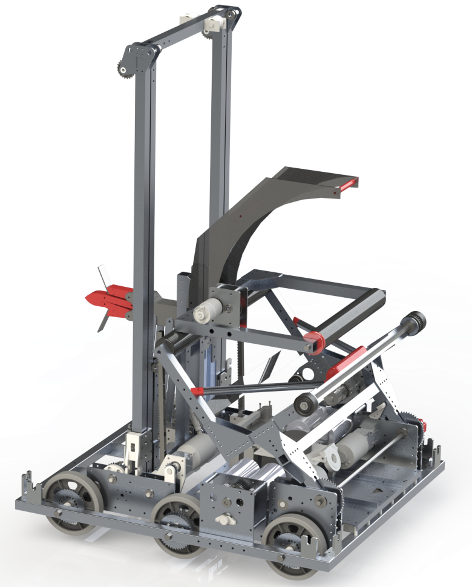
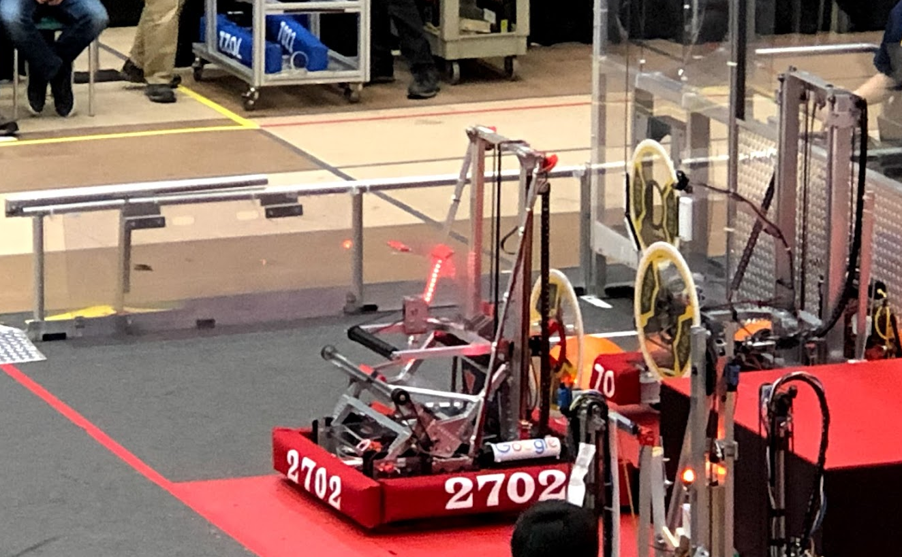
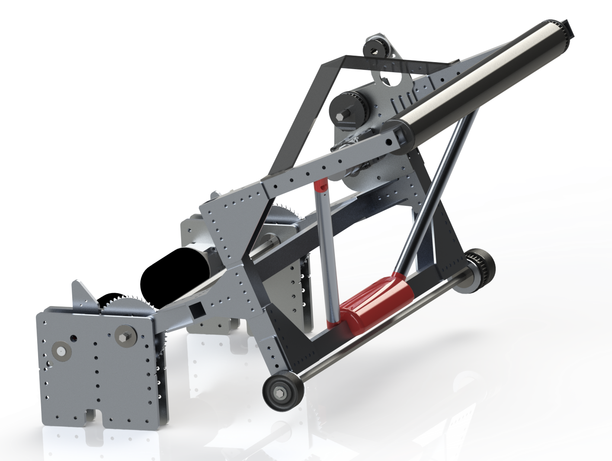
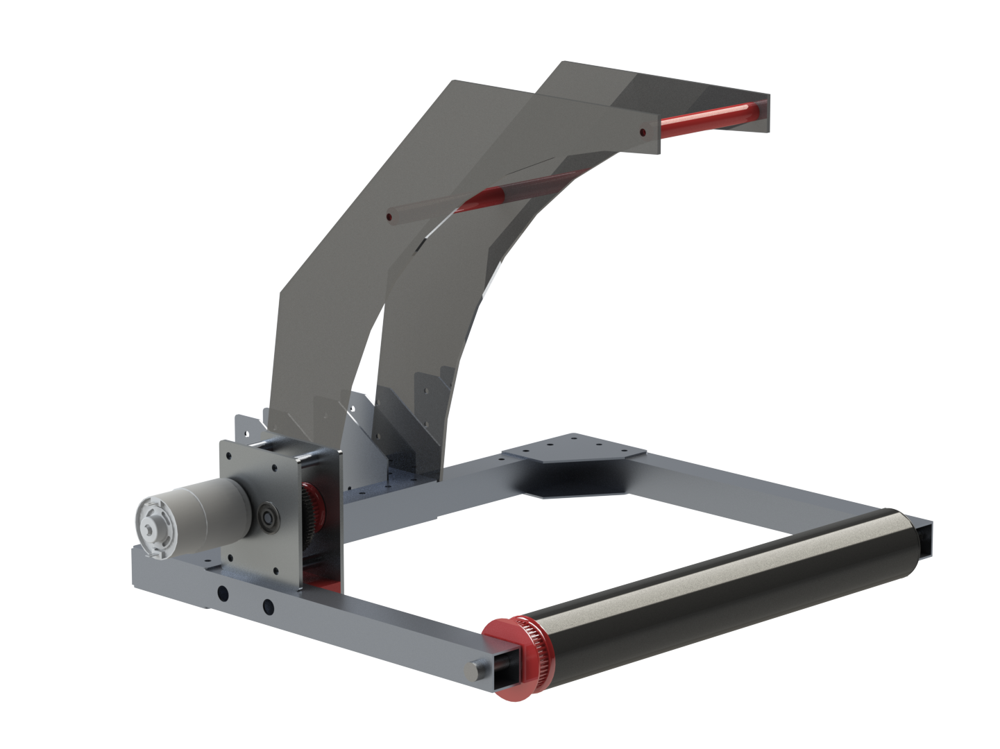
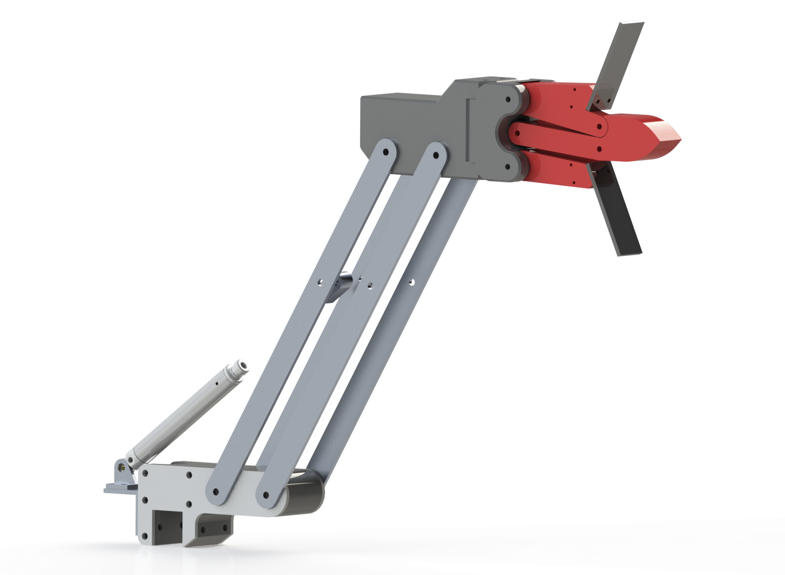
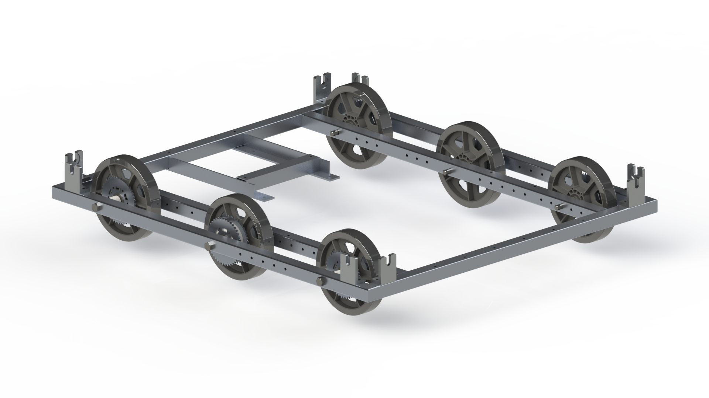

# Overview

I am a part of the [2702 Rebels](https://2702rebels.com) FIRST Robotics team, and we just finished our 2019 robot, named Roadrunner. It was designed to compete in the [2019 Destination Deep Space](https://www.youtube.com/watch?v=Mew6G_og-PI) FIRST robotics competition.

This page takes an in depth look into our robot, with some of the specs and competition numbers. Overall, I am super proud of this robot, as we qualified for the Detroit World Championships! Check it out in action in our [reveal video](https://www.youtube.com/watch?v=Qg6R_3o6a9M).

# Competition

During the 2019 season, our robot competed in 6 competitions, winning 3 awards. Our robot was 46-35-0 (win-loss-tie), and qualified to the Detroit World Championships, in which we were semi-finalists.

# Intake

This intake on our robot was designed to be robust, and pick up balls from many directions. It has two guiding bars, and a limit switch on a crash bar to detect when a ball enters the system. It also doubled as part of our climb, as the two wheels you can see on the bottom reached up to the habitat zone and propelled the robot forward. The intake is an ABS roller run by a 775 motor attached to a Versa Planetary Gearbox, and the whole mechanism is deployed using two Mini-CIMs.

# Shooter

The shooter on our robot is mounted to the elevator, and is also propelled by a 775 Pro. It has an ABS outtake roller, and a plastic guide on the top. When a ball is handed off into the system, a limit switch is tripper to prevent the ball from leaving out the shooter right away. This is how we can tell if we have a ball or not. This shooter is mounted to the elevator giving us ability to deploy a ball on all three levels of the rocket ship.

# Hatch Gripper

The hatch gripper was a part of the robot designed to both pickup and deploy the hatches on the field. It is almost entirely 3D printed, and is mounted on 4 bars of aluminum. It is both deployed and actuated by pneumatics, and has a limit switch behind a piece of lexan to detect when a hatch is ready to be picked up. It is also mounted to the elevator, meaning it can reach all three levels of the rocket ship.

# Drivetrain

Lastly, the drivetrain of the robot is manufactured out of steel, and was welded together. It has six 6 SmoothGrip wheels in a tank drive formation, and is powered by four CIM motors, two on each side.

# My Contributions

As a freshman on the team, I worked with senior design groups to design and manufacture parts for the robot. Although I did not participate on a specific subsystem, I learned many skills such as machining, CAD design, and fabrication. In addition to this, I worked on the business team as well, recruiting and retaining sponsors.

One of my more important roles was to work in the Pits at competition. In this role, I was actively making design decisions to work around problems that we came across, as well as repairing broken parts on the robot. I also was a team spokesperson, interacting with other teams and judges, discussing technical aspects of the robot. It was this work that led the team to win multiple design awards at competitions.

# Resources

* [2702 Rebels](https://2702rebels.com)
* [FIRST](https://firstinspires.org)
* [The Blue Alliance](https://thebluealliance.com)
* [Robot Code](https://2702rebels.com/resource/resource-2019/)

