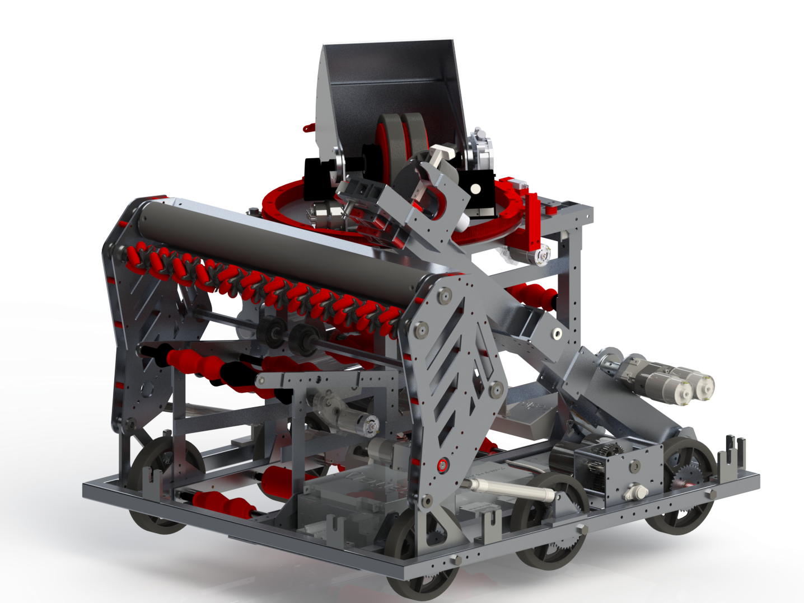
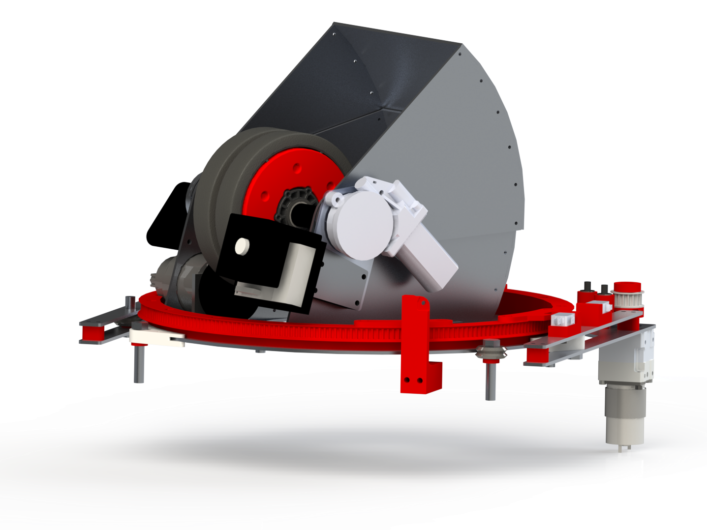

# Overview

I am a part of the [2702 Rebels](https://2702rebels.com) FIRST Robotics team, and we just finished our 2020 robot, designed to compete in the [2020 Infinite Recharge](https://www.youtube.com/watch?v=gmiYWTmFRVE) robotics competition.

This page goes in depth into our robot, with some of the specs. I was the lead student on the feeder subsystem, and also worked on the intake. Check it out in action in our [reveal video](https://www.youtube.com/watch?v=tN_Rt3pt054). Unfortunately, due to COVID-19, this robot has not been able to compete yet.

# Intake

This intake on our robot was designed to both pickup the balls, and center them in a specific location to handoff to the feeder. It is made up of three shafts, an ABS roller, a vectored intake roller made up of 3D printed mecanum wheels, and a shaft with two wheels to handoff into the feeder. All three are driven by a 775 Pro attached to a Versa Planetary gearbox. The intake is deployed by two 6" pneumatic pistons.

# Feeder

The feeder was designed with the sole intention of getting the balls from the intake to the shooter. It is made up of 3D printer rollers and spacers running polycord between the shafts. It is run off of four RS550 motors.

# Shooter

The shooter on our robot is based upon two 6" flywheels spinning to propel the ball. The flywheels are powered by a Falcon 500. The hood over the flywheels guides the balls, and can change its angle based on the distance of the target. It is attached to a worm gear powered by an AM-2235 Snowblower motor. The entire shooter is mounted on a turret that can pivot 270°, powered by a 775 Pro motor.

# Climber/Control Panel

The climber arm is designed to ascend the robot onto the endgame hang bar. It has a hook at the top, and is powered by two 775 Pro motors. It also doubles as our control panel mechanism, as it has two compliant wheels mounted on it. The mechanism is deployed using a pneumatic cylinder.

# Drivetrain

Lastly, the drivetrain of the robot is manufactured out of aluminum, and was welded together. It has six 6" SmoothGrip wheels in a tank drive formation, and is powered by four NEO motors, two on each side.

# My Contribution

As this was my second year on the team, I evolved into a more senior leadership role. I was the feeder subsystem design lead, working to design and fabricate the system. I worked with younger students, teaching CAD and manufacturing skills.

In addition to this, I also worked as the sponsorship lead. I worked to attract, recruit, and connect with current sponsors of the team. I onboarded new sponsors and maintained relationships with over 20 sponsors, working to increase funding for the team and STEM endeavour in the community.

I also worked on the business team. On this team, I worked to plan community events, working to not only raise awareness of the first program but also bring STEM activities to the community.

One goal of the team is to bring Science and Engineering to underprivileged communities who do not have access to these resources and education. Working towards this goal, I volunteered in two different positions, mentoring a [FLL](https://www.firstinspires.org/robotics/fll) robotics team, as well as a FLL Jr team. In these roles, I strived to teach younger students interested in engineering the design process, while fostering an environment for teamwork, cooperation, and creation.

# Resources

* [2702 Rebels](https://2702rebels.com)
* [FIRST](https://firstinspires.org)
* [The Blue Alliance](https://thebluealliance.com)

