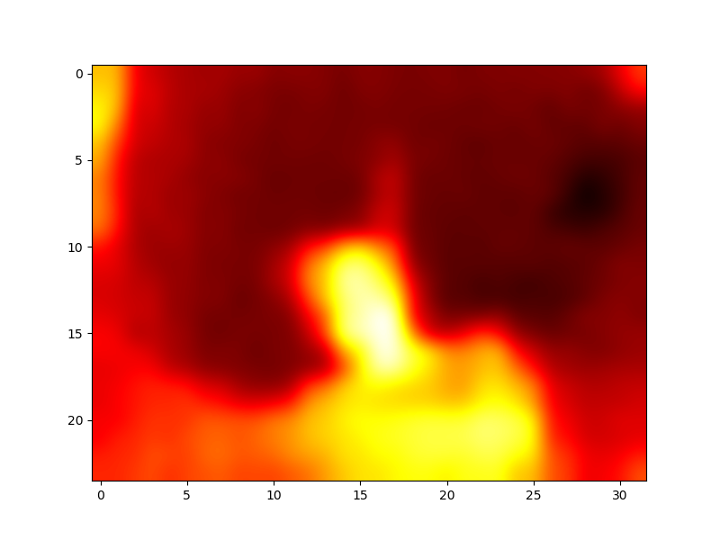
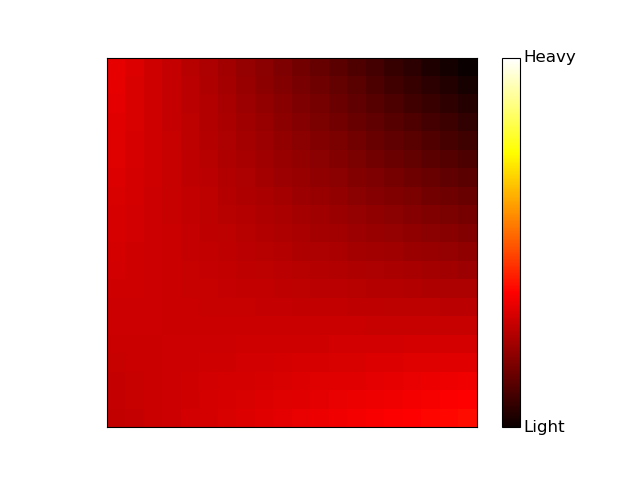

# Overview

The beehive project is a prototype of a beehive monitoring system, to optimize data collection of a beekeepers hives.

## What it does
This prototype was meant as a proof-of-concept to measure important data from a beehive, to inform farmers and save costs.

Some of the project requirements were:
- Have a top view thermal video of the hive (this would give an indication of hotspots for activity)
- Determine the weight distribution of the hive (this would indicate honey levels)
- Have long range radio communication (>10km) to a data storage location, where the data can be stored for access (wifi would be minimal)
- Live camera view of the entrance of the hive, with the goal of eventually using computer vision to detect mass behavior

## Prototype Demonstration
This prototype succeeded in measurment of the required data with a camera, four load cells, and a thermal imaging sensor.

We were able to plot the weight and temperature, as well as save it to a database for future use. Additionally, a livestream of the camera was active on a website 24/7.

