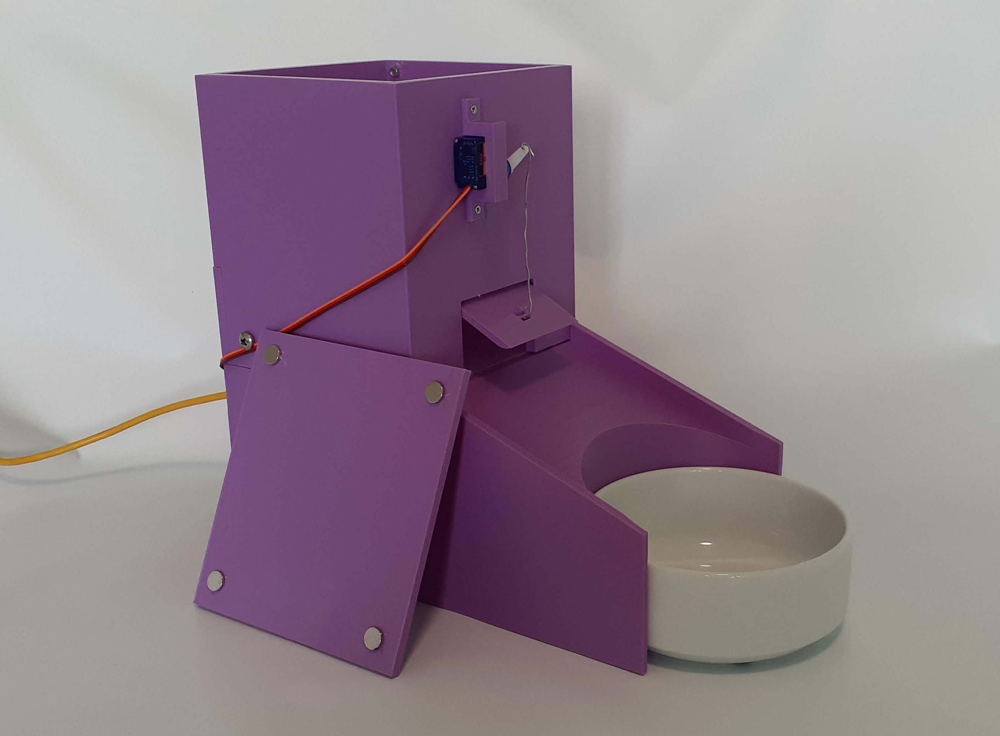
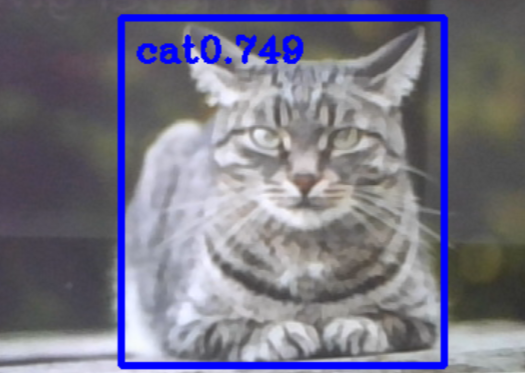
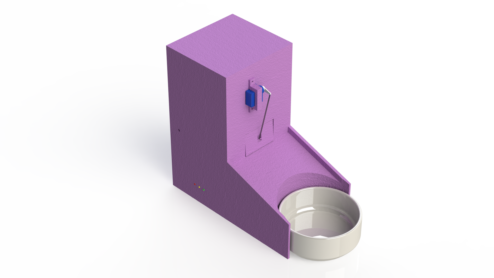
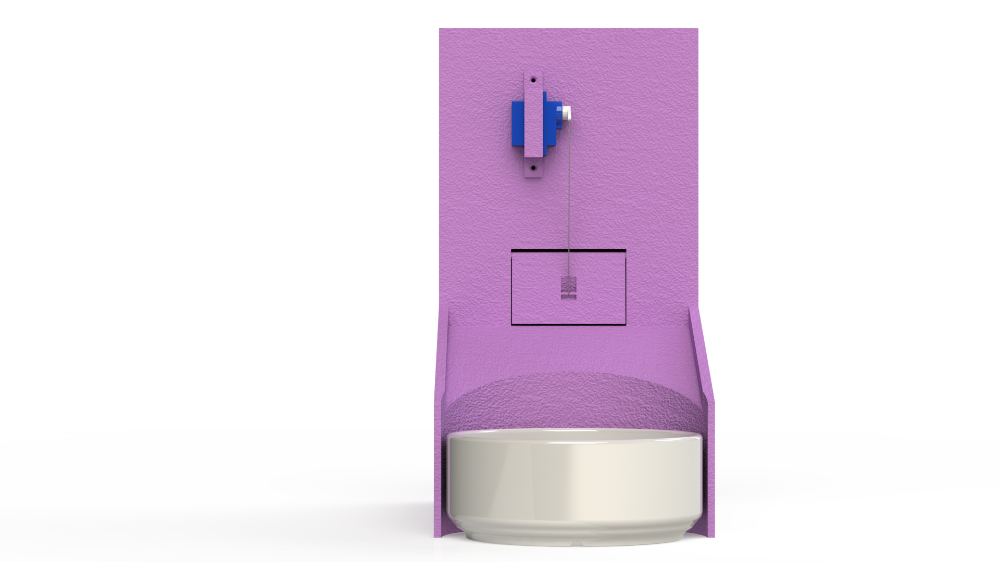

# Overview

Me and my good friend Janik made a automated machine to assist with feeding cats. This was designed for a the [JamhacksV](https://jamhacks.ca/) hackathon. Although I don't own a cat, Janik does, and as a very busy person he doesn't always have the time. Through 3D printing, engineering, an arduino, and some code (written in python and C++), the Cat Feeder was born.

This was the most fun I've had working on a project in a while, and we ended up winning the prize for the best hardware hack.

For technical information the GitHub page is linked at the top.

#### overlay1.png,overlay2.png

# Technical

This machine uses an arduino with a bit of C++ code that Janik wrote. I worked on the image detection, written in Python. I attempted many things, such as training my own HAAR cascade model, but ended up just going with a model that I found online. The machine has 3 preset 'feeding times', in which the live feed will run and look for cats. After a cat has been found, it sends a signal to the arduino to move a servo and open the feeding door.

The image detection is performed using a python library called CV2, getting a frame by frame input from the camera. In each frame, we run the deep neural network to detect cats, and from there send a serial message to the arduino. In addition to this technology, we also have a limit switch on the inside of the cat food tank, and this will detect when the amount of food in the tank is low. From here, the arduino will send a signal back to the python script, which will use SMPTLib to send an email to the user, alerting them that they are out of food.

# Materials

* PLA 3D-printing filament
* Limit Switch (x1)
* Servo
* [Arduino Uno](https://store.arduino.cc/products/arduino-uno-rev3/)
* Leds (x3)
* Camera (any webcam)

# Renders

# Presentation

<iframe src="https://docs.google.com/presentation/d/e/2PACX-1vQ_qndPRcMS981eaumFf-7ngrmvNMw7iQ4JSmGQSEzTWncwji2L591YMbT5SIpTrf_QRkFLuShqt2sB/embed?start=false&loop=true&delayms=3000" frameborder="0" width="700" style='height:408px' allowfullscreen="true" mozallowfullscreen="true" webkitallowfullscreen="true"></iframe>

# Showcase

<iframe width="700" height="393" src="https://www.youtube.com/embed/R7FwRFxINBM"></iframe>

