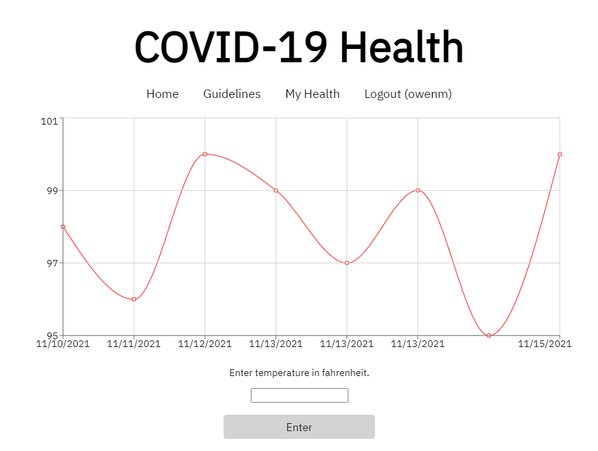
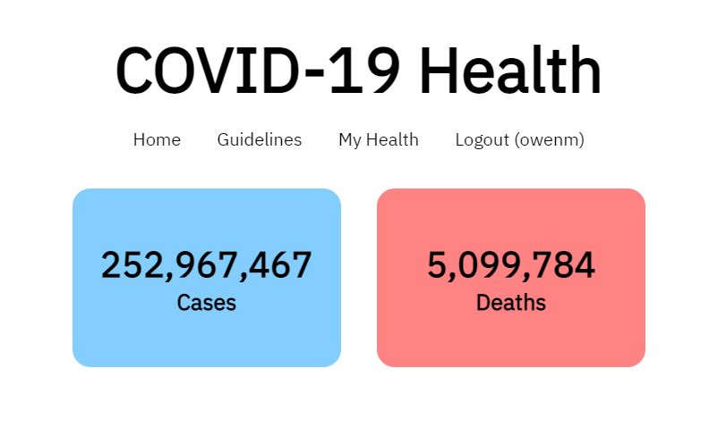

# Overview

In my first ever hackathon, run in January 2021, the theme was about COVID-19. Participating in this, I created this COVID-19 Health Application, using a frontend application. After completing the hackathon (in which I was a runner up), I decided to continue with the app and add functionality with a backend.

This app allows a user to track their temperatures, collect points, check the current COVID numbers in their areas, and view public health guidelines.

# Technical

This uses a web scraping application to retrieve COVID-19 data, and then displayes it using a fullstack application with Django and React. On the backend, we can track user temperatures and data, and provide an easy to use hub, for everything COVID.

