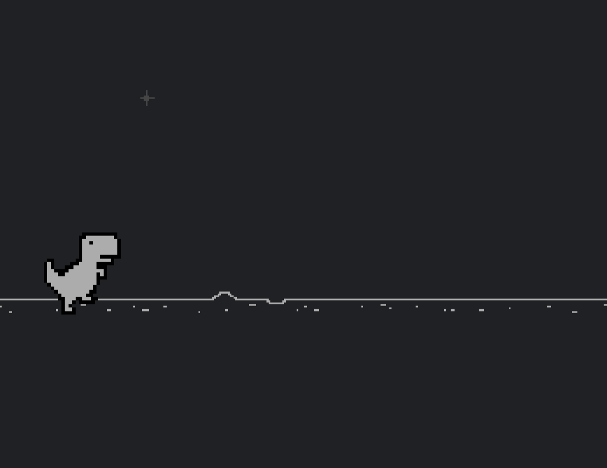

# Overview

This project is quite similar to my [Flappy Bird AI](https://github.com/owenmoogk/flappy-bird-ai). It was lots of fun and I continue to love coding with AI or neural networks.

# Technical

This was a visualization of the NEAT algorithm at work, learning how to play the infamous Dino Game. It was all coded in python, and shown using Pygame. It is using the [NEAT-Python](https://neat-python.readthedocs.io/en/latest/neat_overview.html) module, which does most of the heavy lifting for me, but gives a great introduction to the basics of neural networks.

