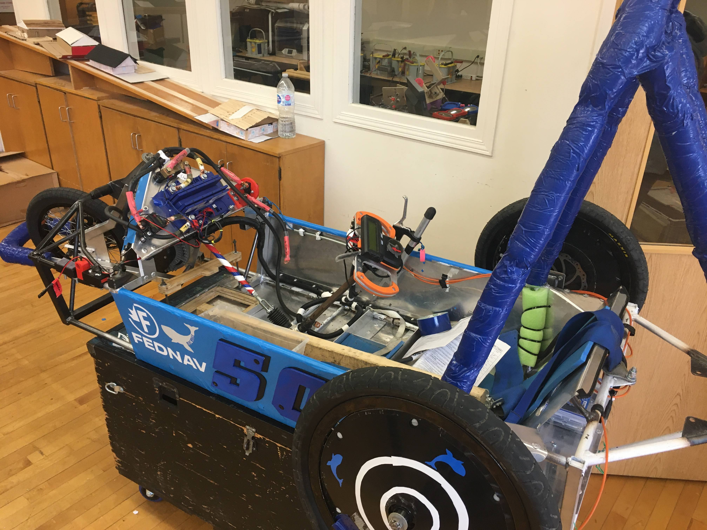
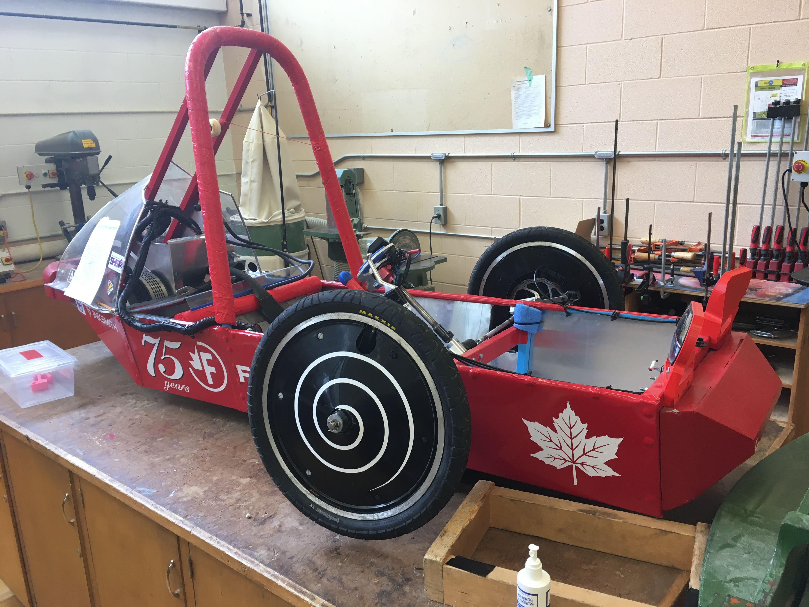
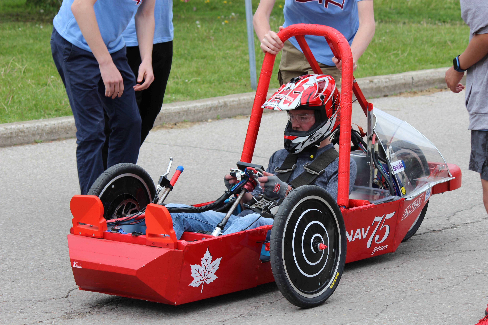
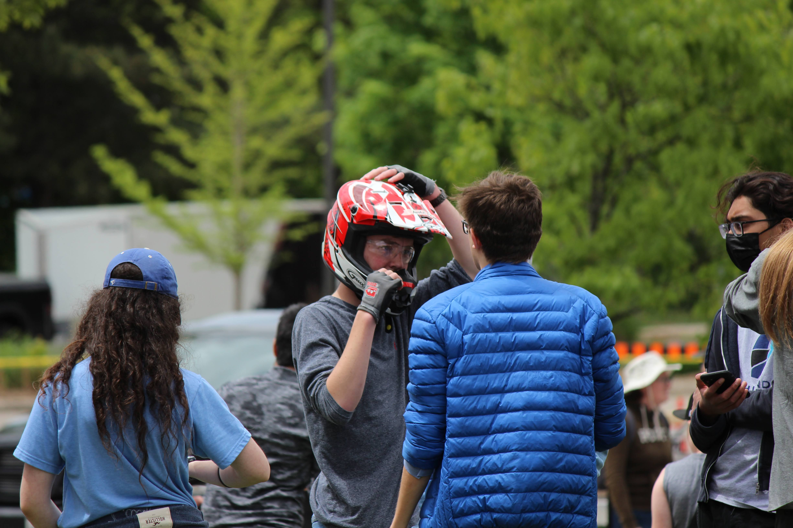
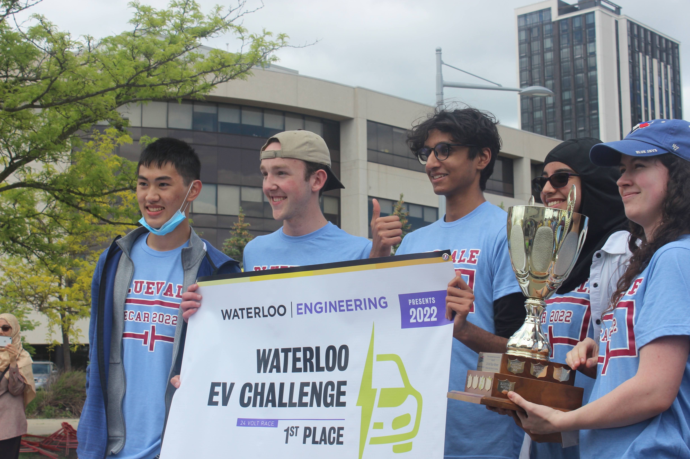

# Overview

I am a part of the Bluevale Collegiate Electric Car Team, where I work with a small team to develop and build electric racecars. I took the lead on a few different aspects of the car, including designing an emergency stopping system, working on a driveshaft system, and fabricating an effective braking system.

# Images

# Competition

This car was designed to compete in the University of Waterloo Electric Vehicle Challenge. It is an endurance race where teams compete to complete the most laps in a set amount of time. There are two categories, 12V and 24V, with the winner of the 24V winning the opportunity of showing the car at the Toronto Auto Show. In the 12V race, our team finished first and second with the two cars that we entered, and in the 24V race we came first.

