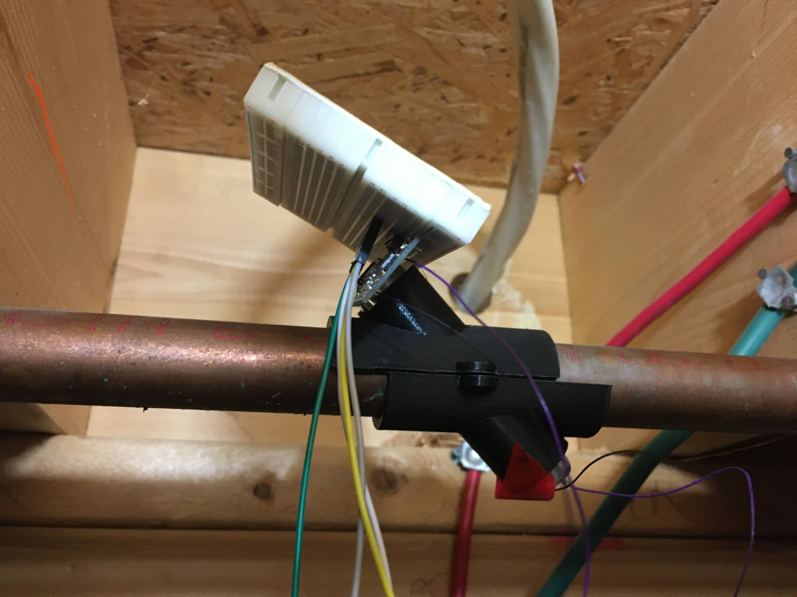
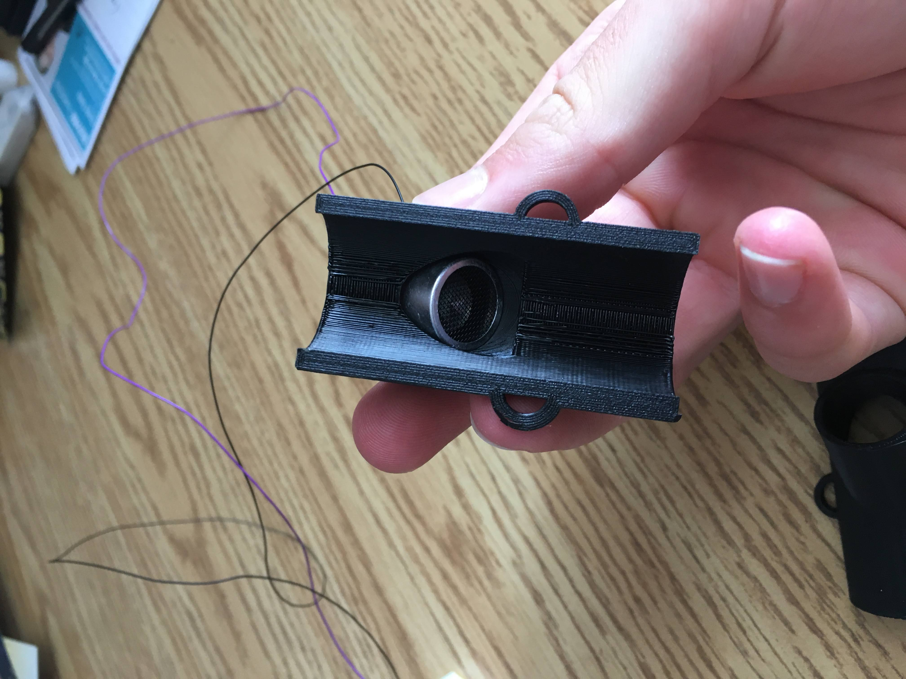

# Overview

This ultrasonic flow rate sensor was the solution I designed to a design project for the SHAD program. I participated in this program virtually through the month of July, and the biggest challenge was the design project, coming up with a solution to a real world problem. This year we were tasked with encouraging Canadian homeowners to be more respectful of the water that they are using.

So, with my design team, we came up with the solution of tracking water usage at different locations of the household to provide meaningful insight into water use habits, which can be compatible with greywater systems, and many appliances. This sensor worked hand in hand with an app to integrate smoothly into the homeowners life.

# Design

I personally led the design of the flow rate sensor, in which we were trying to solve two main issues, being cost and convenience. There are many flow rate detectors that are quite accurate but have to be inserted into the pipe, which requires a lot of work and is not very cost effective either given install costs.

The other option is using ultrasonic sensors or something of the sort, therefore not needing to cut through the pipe at all. This can be convenient but is very expensive given current solutions, ranging from 4000-6000 dollars.

# Components

This was designed with an Arduino Uno, connected to an ultrasonic sensor. I had to take the ultrasonic sensor and de-solder the transmitter. This left two separate modules that could communicate with each-other. This was then attached to some 3D printed housing (see below), which allowed it to be clamped onto the pipe.

<video src='desc.mp4'></video>

# Result

In the end, we were very happy with our results, designing a full application and the hardware solution, along with creating a business plan and marketing content. I talked here mostly about the hardware as that was my focus, specialty, and what I am most passionate about but it really was the basis of starting a business. Here is the [One Pager](/assets/projects/ecoflow/onepager.pdf) we created, and you can also check out our [App Prototype](https://www.figma.com/file/5FlCRbLdZS3zMjbsdgtB1w/Water-App-Prototype-(Copy)?node-id=0%3A1).

# Demo

<iframe width="700" height="393" src="https://www.youtube.com/embed/gqaufJdyn3E"></iframe>

