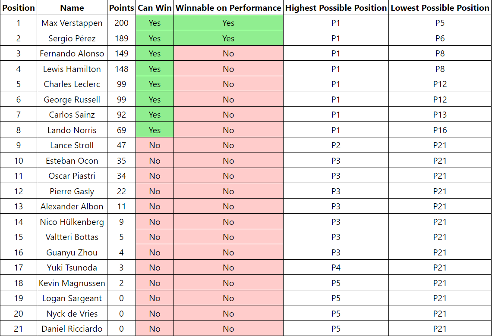

# Overview

Watching the recent Formula 1 season, I was constantly doing the math to see which drivers need to outscore others to clinch positions in the championship. I build this to give me some of the information that I was frequently calculating.

# Functionality

The program takes into account the current drivers points, and the amount of points remaining (races, sprints, fastest laps). Using this information, I calculated highest and lowest possible positions, as well as if the championship was still in reach.

It can also be seen above (or on the website), that there is a column for "Winnable on Performance". This column shows whether or not the driver will win if they perform to the maximum. This is interesting because although some drivers can still win the championship, winning every remaining race won't guarantee it.

