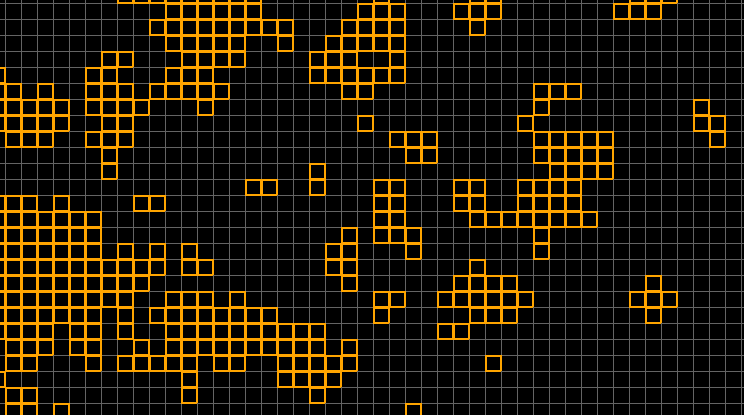

# Overview

This is just a small application that I thought was really interesting, which can recreate some behavior of fireflies in the wild. It is implemented with python and Pygame, and it works pretty well at the moment. One thing that I would really like to try is to allow them to move about the screen, giving an added layer.

# What are we simulating?

Fireflies have a property in which they observe other fireflies around them, and blink according to what they see (a firefly is a bug that can illuminate itself). Based on what others are doing around them they adjust their timing to be more like the group. Over only a few seconds small interactions between fireflies create large chains and synchronizations. If you have ever seen them in nature, they all seem to blink at once, and this is why.

