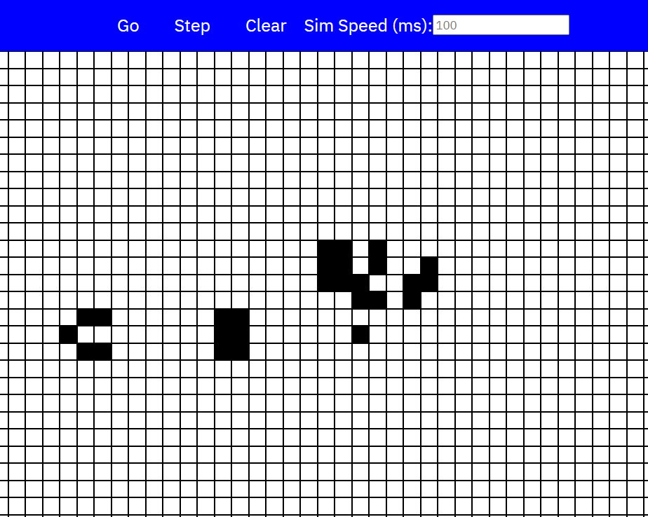

# Overview

Conway's game of life is a game with some simple rules, that dictate the birth and death of cells. This interested me however, because this simple simulation is Turing complete, meaning that it can simulate anything that a typical computer can (even being able to simulate the game within itself). I built this as a way to familiarize myself with the game, and also have a way to mess around and try some things.

It's linked above, so anyone can play around with it!

