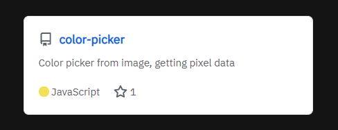

# Overview

The React GitHub Card is made to be used very easily. It takes the base GitHub Card that is found on plenty of website, and turns it into a react component with lots of settings, automatic fetching and updating of user data.

# Technical

React is great as it implements props in components. I took full advantage of this, as you can just import the component, and give it a username and repository. It will pull all the data from the GitHub API, and will automatically update with stars, forks, etc. It has emoji support and additional settings letting you change the display of different aspects. The website displaying it and the GitHub page are linked above.

