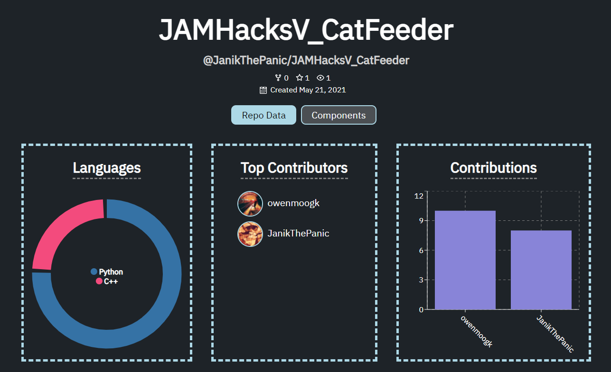
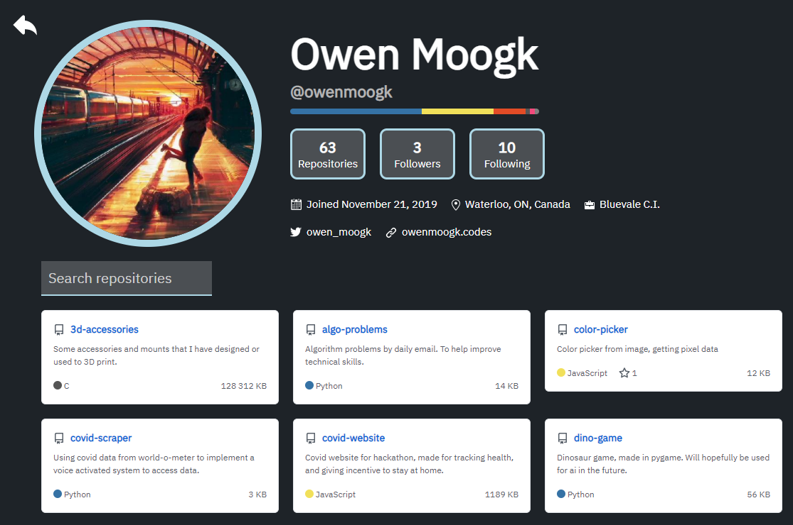
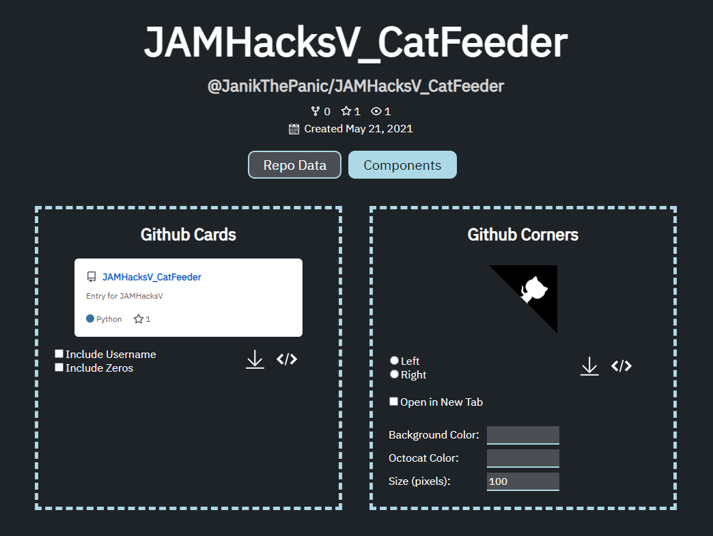

# Overview

I had recently discovered the Github API, and as a avid Github user I wanted to have a nice hub for my data. I realize that many other people have created pages for Github data, but this also includes Github Cards, and Corners to show off a repository in HTML. You can view any repository's contribution data (who has made the most commits, etc), as well as any user and their stats.

The last thing that I added that was cool was an option to input an API key. I have seen a few other websites, but they are capped at the 60 request limit Github imposes, which can get quite limited. I have a few API keys active, as many others do I'm sure, so the key can just be inputted and it will save in localstorage. Now we have 5000 requests!

Both the website and Github page are linked above.

