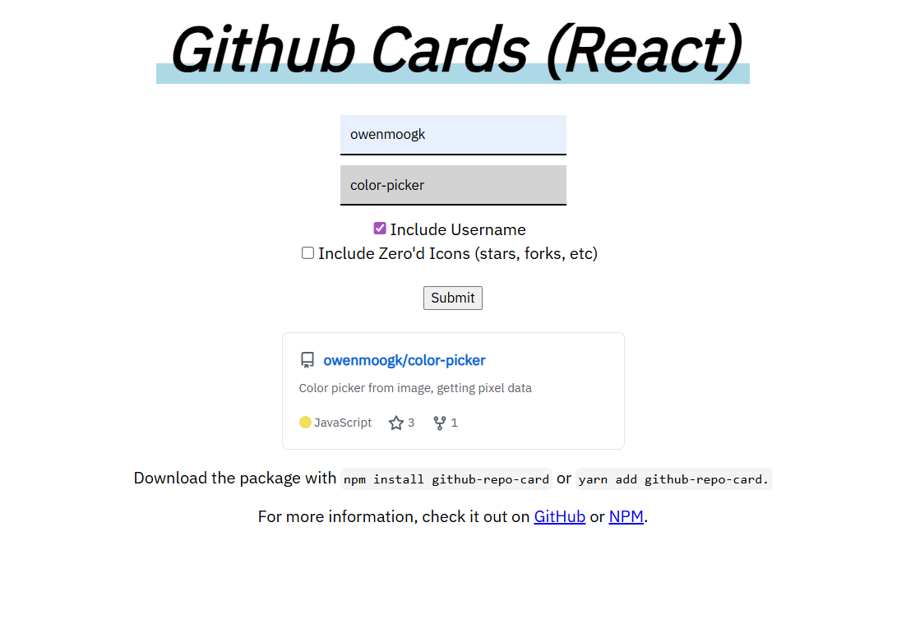

# Overview

The React GitHub Card is a React component made for easy integration and stat fetching from the GitHub API. It takes the base GitHub Card that is found on plenty of website, and turns it into a react component with settings and customizable features.

# Technical

This is a simple react component, and it's released on NPM for anyone to use. It's also demo'd on [this website](https://owenmoogk.github.io/github-repo-card) where you can try it out and simulate all of the different components.

More details are in the [GitHub](https://github.com/owenmoogk/github-repo-card), but you can get started with `npm install github-repo-card` or `yarn add github-repo-card`. Enjoy!

## History

This project started in June of 2021 (writing this in July 2025, 4 years later). I was getting into React after a few years of web development and was amazed how React could simplify a codebase so effectively. So I made this component, and put the file online for people to download (whether anyone did or not, I'm not sure).

Flash forward 4 years, and I'm going through old repositories. It doesn't look like a bad idea, but I *put in online as a downloadable file*. I guess everything that my package manager was doing didn't click.

Anyways, I've since released it on NPM, and it can be downloaded and used in React projects. I've also kept the writeup I made about the project 4 years ago, because it's almost cute how taken-aback I am by React:

> "React is great as it implements props in components. I took full advantage of this, as you can just import the component, and give it a username and repository. It will pull all the data from the GitHub API, and will automatically update with stars, forks, etc. It has emoji support and additional settings letting you change the display of different aspects."
