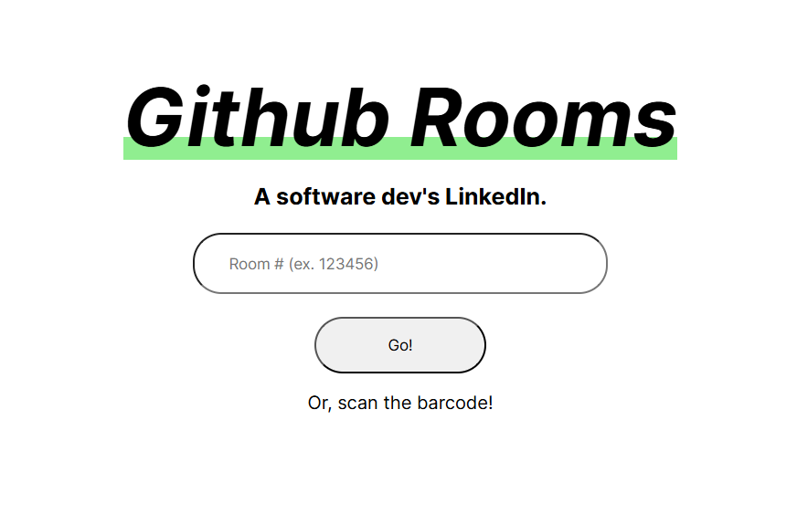

# Overview
This was our project submission for Hack the North, 2022.

## Inspiration
As we were coming up with ideas for this year's hackathon, we were amazed by the HackTheNorth nametags. We both thought that it was awesome to use QR codes to connect people, and was a great metaphor for all the technology happening at HackTheNorth. We wanted to continue this, and connect even more people with intriguing technology. This is why created GitHub Rooms.

## What it does
GitHub rooms is a tool that allows people to view and add to a repository of projects, which others have worked on in the same space. Anyone can create a room, providing them with a QR code that they can print out or display to anyone in the area. Then, anyone using the space will be able to scan it and upload what they have been working on. This is great for community spaces, where there is lots of varying development of tech, and it will enable people to connect with those in their community who share similar interests.

## How we built it
We built this with a full stack system, using React and Django. It was made with a SQL database for keeping track of all of the users and projects integrated into our system, and Django to process requests from the frontend. React is the frontend, which is quite dynamic and creates simplicity in the code.

## What's next for GitHub rooms
We want to continue to develop this and create something that can connect people in community spaces. We hope to add more features, such as commit tracking, profiles, and networking. In the meantime though, we are happy with what we created!