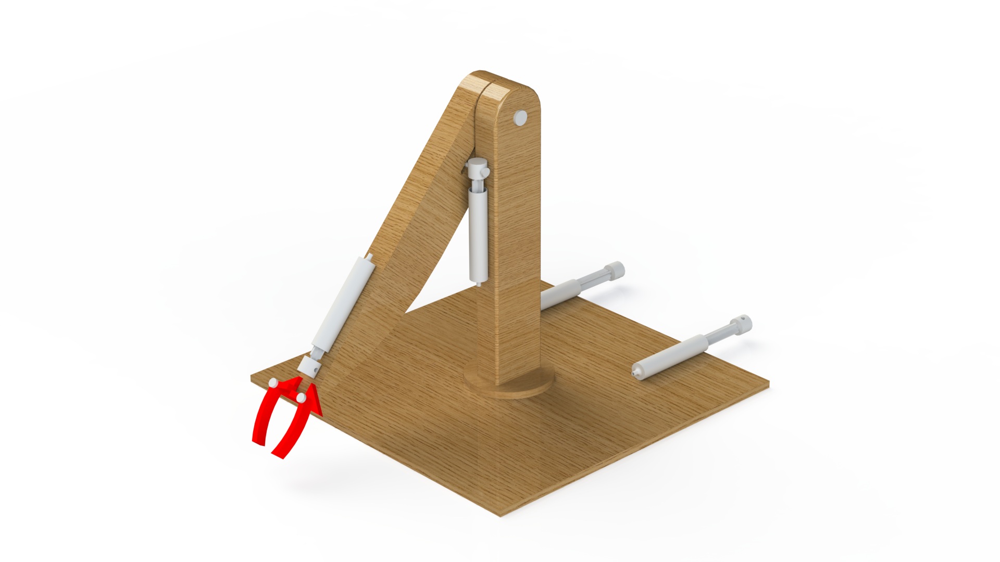

# Overview

I recently made a hydraulic arm for a school project. It was tasked with moving a small toy bin along the X and Z axis, and this was the solution I came up with. It rotates with strings, and the height and claw grip is controlled using hydraulics. I have the CAD as well as some renders down below.

The red claw was 3D printed, and the rest was made from wood and dowels. String was attached to the bottom plate which can be pulled to rotate the arm, and tubes connect the syringes at the bottom with the ones on the arm. There is one dowel through the center into the base which the whole module revolves around.

# Renders

