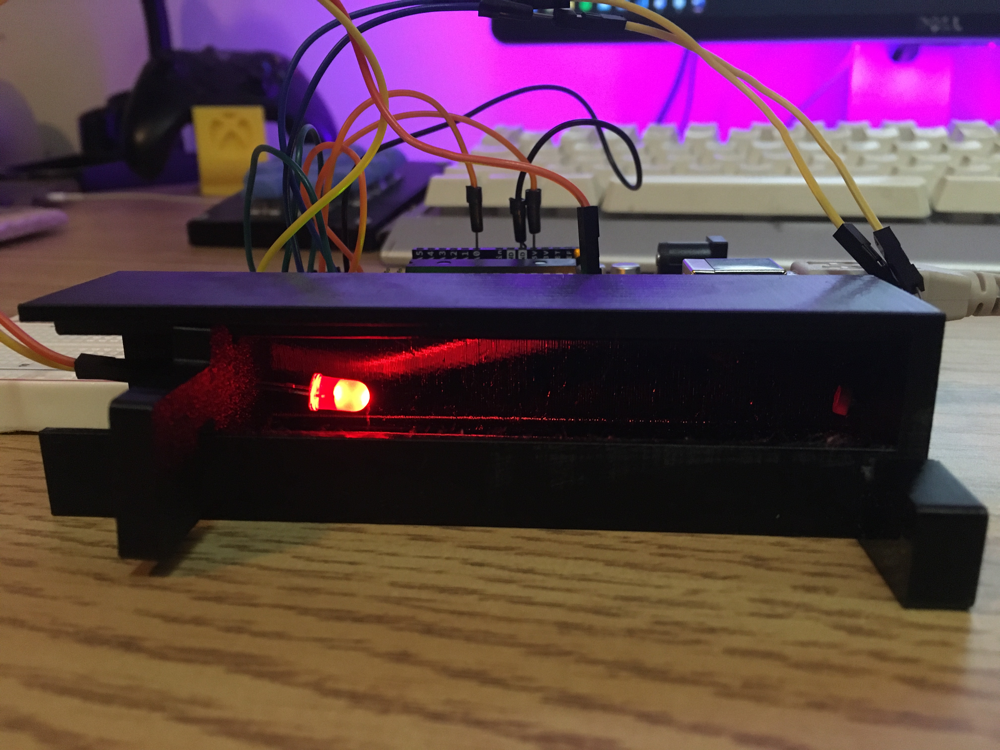
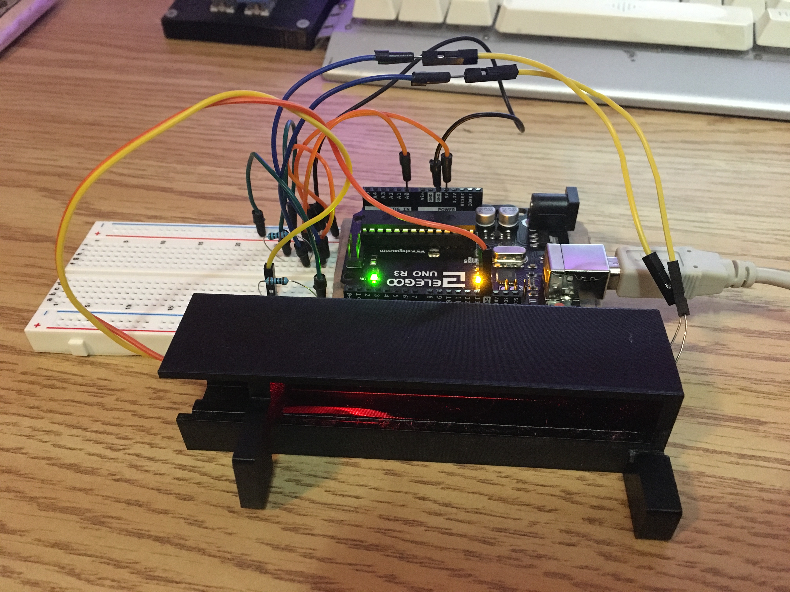
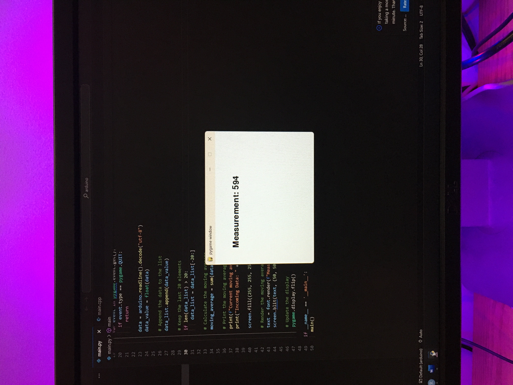
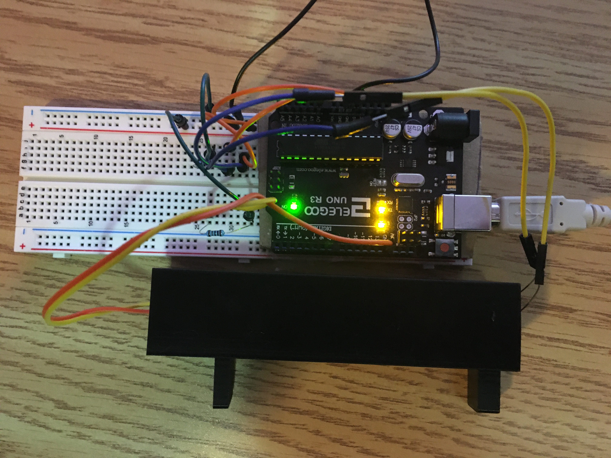

# Overview

For my statistics class, myself and my peers were tasked with creating a custom measurement system (without using any COTS components that could do so). We decided to make a caliper-type device that could measure distance, using and LED and a photoresistor. The principles of operation are fairly simple, the light intensity dissipates at further distance, which can be converted into a distance.

# Learning

The main learnings from this were the calibration process, collecting data and finding the best fit for our data, while also identifying systematic and random error from the system. Our group created a report detailing this process that can be found [here](/assets/projects/light-calipers/report.pdf).

# Images

