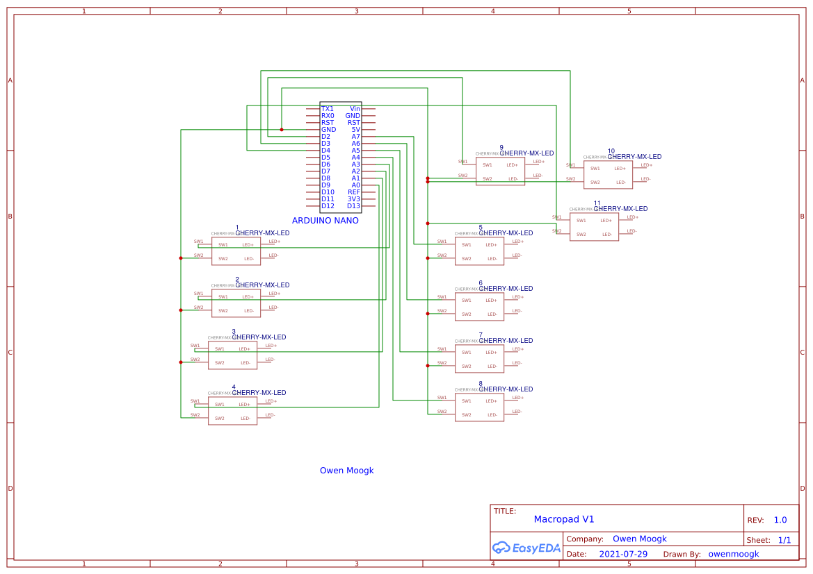
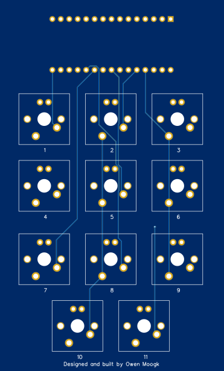

####::compare-image[overlay1.png,overlay2.png]

# Overview

When looking for a macropad on Amazon, I found that everything was overpriced, with little functionality. Then I remembered, I have a 3D printer! With some CAD, Python, and C++ the custom macropad was created.

# Technical

This gadget employs the functionality of an Arduino Nano, connected to 11 Cherry MX Blue switches. Using the input-pullup feature on the Nano, we can implement detection for keypresses by just connecting the switch to a pin and ground. From here, the arduino will send a serial code to the computer, which will be read by a python script (that is consistently running on startup). This python script is able to execute Spotify API calls, simulate keystrokes, or do anything else with the capabilities of python, nearly limitless.

# Electrical

I used EasyEDA to design a schematic and an PCB, which I ordered using JLCPCB. It was an awesome experience learning how to make a PCB, and I think that I will use this skill for future projects. Check it out below, or open it on [EasyEDA](https://easyeda.com/editor#id=53ef828834a34f2d87e6da74e034d6bf).

# Materials

* PLA Plastic Filament (housing, keycaps)
* [Cherry MX Blues](https://www.aliexpress.com/item/1005002588583066.html) (x11)
* [Arduino Nano](https://store.arduino.cc/products/arduino-nano)
* [JCL PCB](https://jlcpcb.com/) Board
* USB Mini-B Cable
* 1/4" 10-24 Machine Screws (x4)

# Functionality

In the end, am I using it? No. I thought it would be wonderful to have additional programmable keys on my keyboard but it turns out it was more of a hassle than it was worth. I do believe that this is very practical, as being able to activate a python script with a keypress has limitless potential. I also had a bit of trouble configuring the input pullups, which would trigger multiple keys on one keypress. After consulting an electrical engineer about the problem still no solution was found, I am concluding that it results from buying cheap Arduino's off of Aliexpress. Nevertheless, a very fun project that has a lot of potential.

Update: I have since taken all the electronics out of the box again and after some troubleshooting got it to work. I am now using it and it is awesome. Have a look at the pictures above for it connected to my keyboard.

