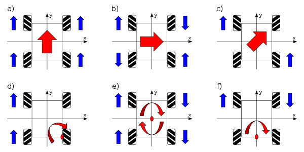
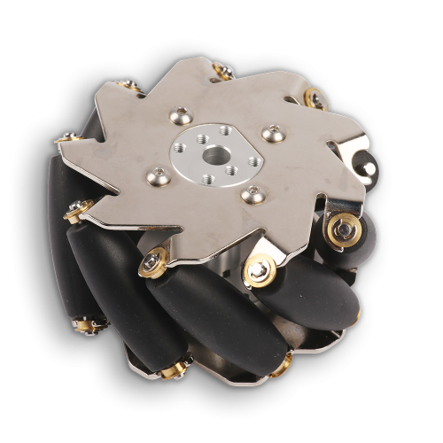
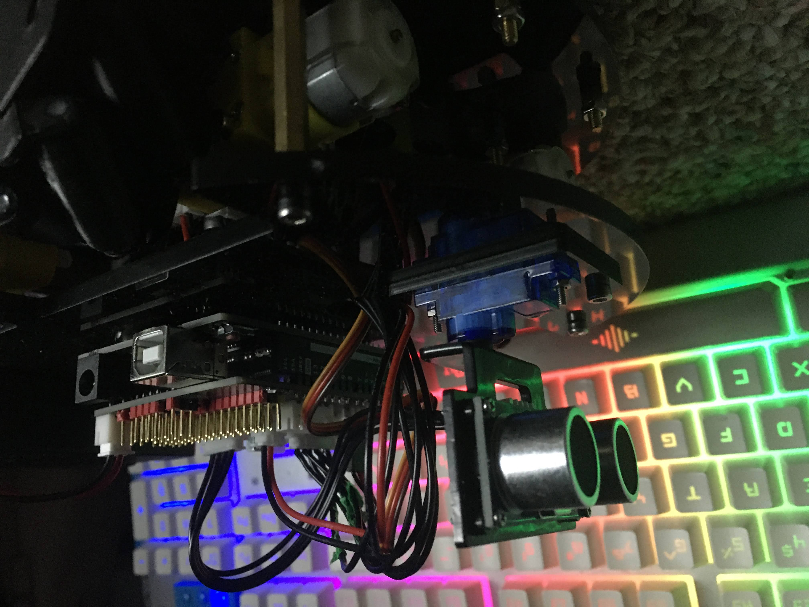
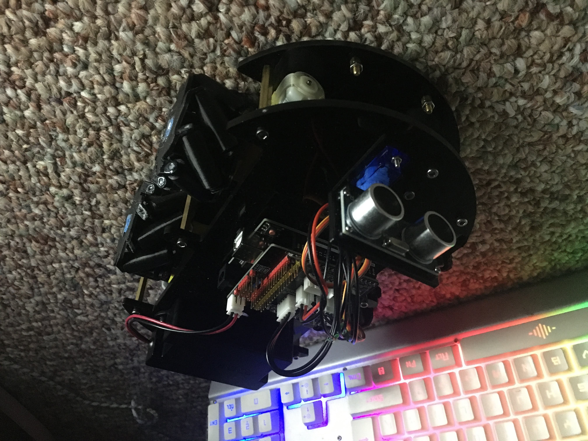

# Overview

I was looking into some mechanical projects to try, as I had just gotten my new 3D printer, and I thought about making a mecanum drive robot. This leads to tank drive, with the additional movement in all directions without turning, as shown by the picture below.

# Mecanum Wheels

Mecanum wheels are super cool as the wheels have rollers on them, angled at 45 degrees. Mine are all 3D printed, but have the same operation of this picture below. This leads to a diagonal force being exerted, and spinning creates multiple different possibilities when associated with other wheels.

# My Robot

I used an Elegoo Kit for this as I had one on hand from another project. I made adapters for the wheels and all of that was 3D printed. All the CAD (some incomplete), is on GitHub, linked at the top. Components include:

* Elegoo UNO R3
* Elegoo V5 Extension Board
* L298N Motor Driver Board
* 4x Motor
* Battery
* Mecanum Wheels

