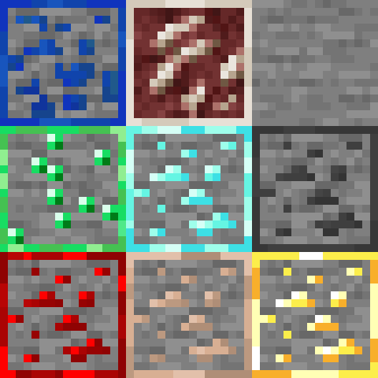
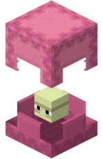

# Overview

I am a player, who has logged many hours on the game Minecraft. I recently discovered resource packs and datapacks, and I wanted to incorporate them into my gameplay. After doing some research and looking at others, I created my own resource packs and also have my own mix of datapacks. I have all files available for download on my GitHub, as you can find at the bottom. Enjoy!

# Resource Packs

In the downloads found here, you can find some resource packs. One is the custom texture pack, one is an X-ray pack, and the others are small are customizations. The main pack has changes to some plants for easier identification of growth stages, as well as changes to the textures of many redstone components for ease of use. This includes on and off specific textures on pistons and levers, as well as arrows for hoppers, observers, and dispensers/droppers. The goal of this is to let for easier redstone and technical gaming while still keeping the basic feel of vanilla Minecraft.

The other two resource packs are solely for redstone wires. One displays the wires as bars stretching across the blocks, as commonly used by many (Codecrafted, Faithful, etc.). The other is less visually appealing, with the signal strength on the wire. There are two separate packs for the reason of toggling between the two packs.

# Blocks

* Observer Arrow and pulse indicator
* Sticky piston indicator on back
* Mock LED indicators for extension and retraction (different colors for different types of pistons)
* Additional arrows on hoppers
* Arrows on dispensers and droppers (white and black accordingly)
* Rails more animated
* Pumpkin and melon stem differentiation
* Added functional side textures to repeaters and comparators
* Scaffolding is now somewhat clear
* Cauldron shows level on side
* All ores are highlighted
* Lever has glowing texture when activated
* Added colored cobble like textures for granite, andesite, and diorite
* Emerald block now more similar to iron block
* Removed white pixels from all flavours of ice
* Updated glass to have a cleaner texture
* Updated wool and carpets to be a solid color with border
* Nether wart turns green when fully grown
* Added colored particles to the enchanting table
* Jukeboxes have a different top texture when containing a disc
* End rods do not have a base

# GUI

* Rainbow XP bar
* Colored connection symbol
* Title screen background includes iron farm
* Custom splashes ;)
* Custom paintings (Including brewing stand chart)

# Sounds

* Quieter minecarts, cows, pistons, droppers/dispensers, nether portals
* Classic "OOF" damage sounds
* Custom Andrew Applepie and Kasey Andre songs on music discs, which look like Celeste B-Side tapes.

# Datapack

My custom datapack includes custom crafting recipes to return blocks (such as half slabs, doors, fence gates, etc.) to their original material. It also has increased drop loot from both shulkers and wither skeletons. The goal of this is again to keep the vanilla feel of Minecraft while allowing for recipes that some players may find convenient. The drop rate increase is designed for servers where resources are limited.

# Resources

* [Vanilla Tweaks](https://github.com/owenmoogk/minecraft_modifications)
* [Crafting Generator](https://crafting.thedestruc7i0n.ca)
* [Planet Minecraft](https://www.planetminecraft.com)

