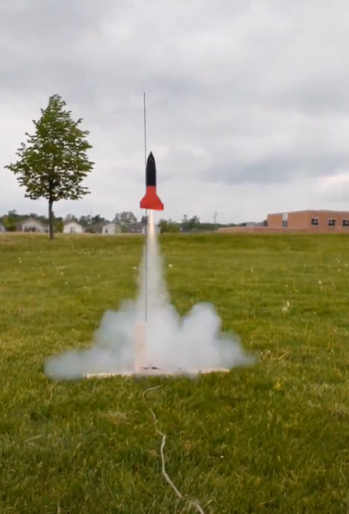
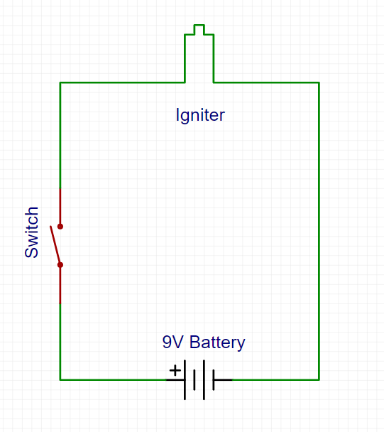
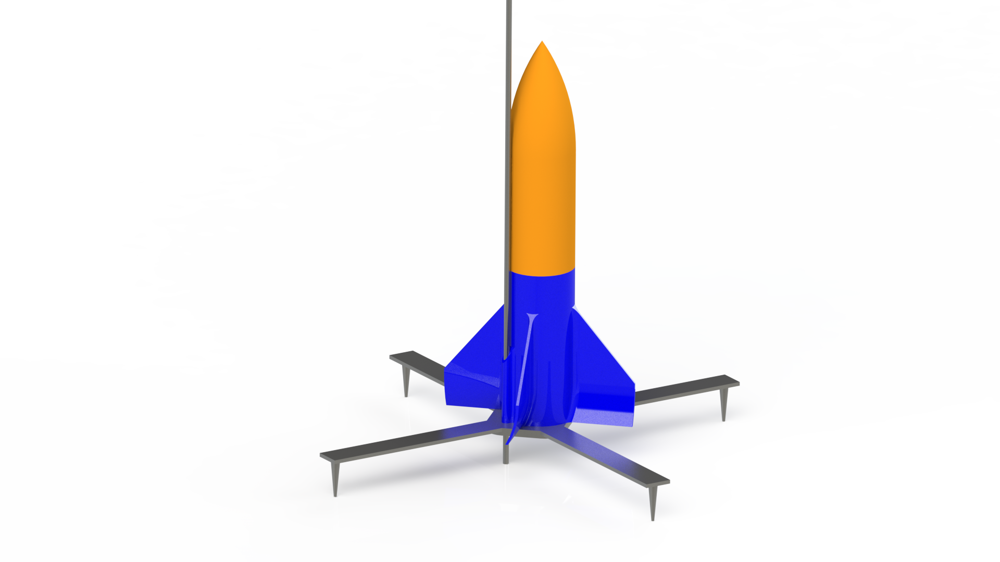

# Overview

I was getting into 3D printing, and had just bought myself a Ender 3 Pro. This was really fun to make! I 3D printed the whole thing, and recently launched it. Part one was a success, part two with a parachute has had one test launch... it didn't go well, as I forgot about heat retardant materials and melted the parachute. Next design coming soon (and I'll include a video next time)!

::compare-image[overlay1.png,overlay2.png]

# Videos

Here's a video of the rocket in action!

<video src='launch2.mp4'></video>

<video src='parachute-test.mp4'></video>

# Materials

This was designed and 3D printed, so the whole of the rocket is made of PLA plastic. I printed part of it at school on a [Cubicon Single Plus](https://www.inksmith.ca/pages/cubicon-single-plus) (shoutout to Mr. Cox for letting me use the school printer) and the rest at home on my [Ender 3 Pro](https://www.creality3dofficial.com/products/creality-ender-3-pro-3d-printer) in three different parts, and attached them all. One thing to note is that this first design does not include a parachute, so it did just fall from the sky :). I used a makeshift launch stand, which was two 2x4s attached with one screw, and used some hockey tape to attach a 'launch rod' that I got from Home Depot.

# Engines

The engines were C6-3 engines that I got from the [Canadian Rocket Store](https://www.allrockets.ca/). This was actually very interesting, as since I designed the rocket to be 3 separate parts, after the delay it blew up. If you aren't aware, the rocket engines have a delay on them, these engines 3 seconds, and after the delay it shoots gas into the top of the rocket, pressurizing it and causing the top to pop off. This is meant for parachute deploy on time, but this ended up just exploding the rocket into a few pieces. I kind of expected it, but it was funny to see it blast apart in a puff of smoke.

# Physics

So I did some quick calculations with my grade 11 physics knowledge, just to find its probable apogee and velocity. Here is what I came across:
<iframe frameBorder="0" width="800px" height="100%" style="min-width: 400px; min-height:600px" src="https://www.mathcha.io/editor/10JLmhV1HvqhW4gK9ocX6QK9xFv7LzVvHJJmLG5?embedded=true"></iframe><iframe src="https://www.desmos.com/calculator/wpvjgrsnpr?embed" width="500px" height="500px" style="border: 1px solid #ccc" frameborder=0></iframe>

# Electronics

I also had to work up some sketchy electronics to get the igniter to go, here's the layout:

# Renders

