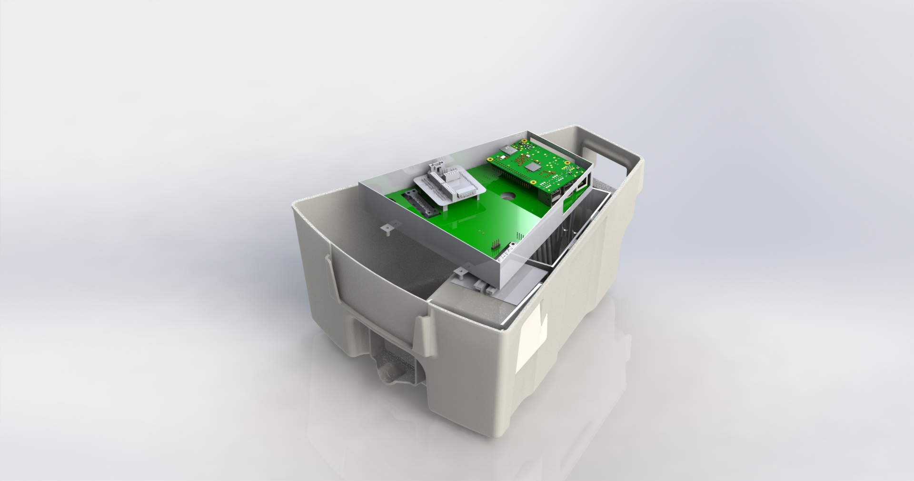
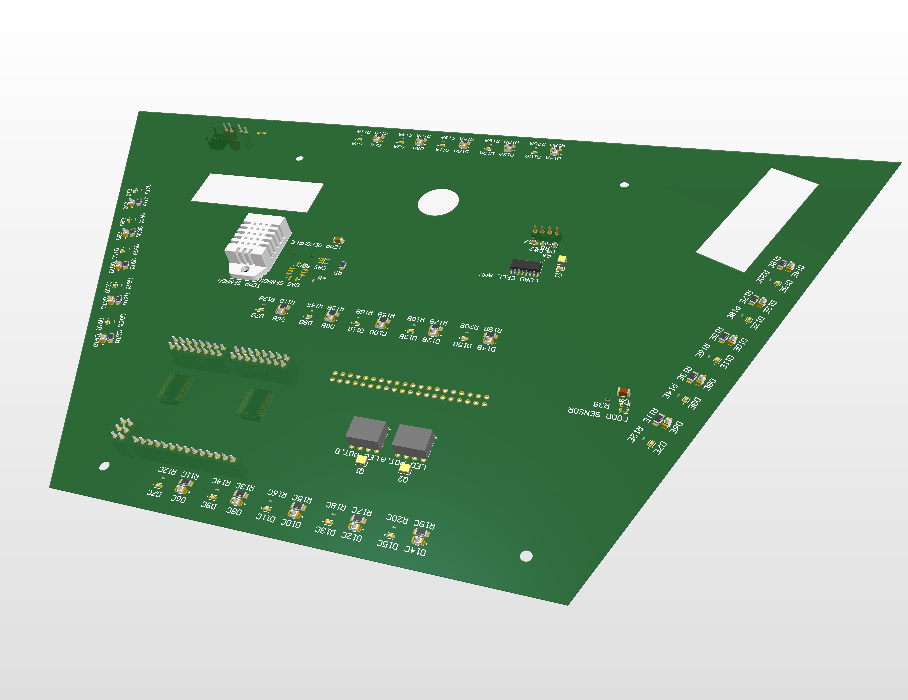
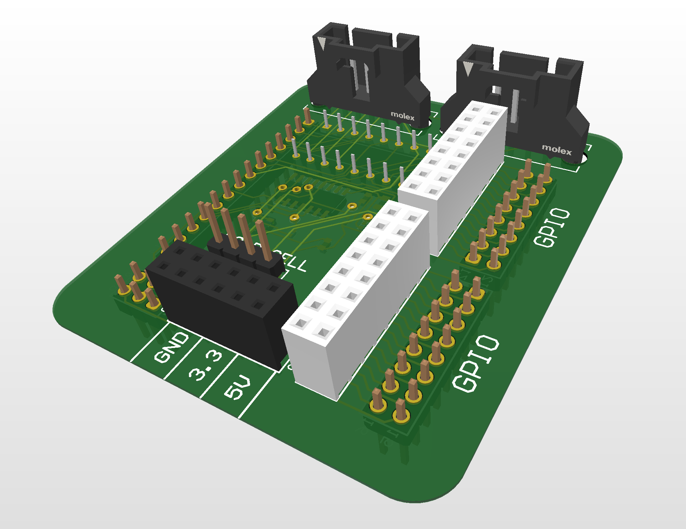

# Overview
As part of my involvement in the ULethbridge Hub for Neuroengineering Solutions, I designed custom schematics and a printed circuit board for mouse cage environment monitoring. This had many functions, including illiumination (in both IR and visible light), camera recording, gas monitoring, water delivery sensors, and more niche application-specific functions. Additionally, it was designed to be expandable for future projects.

# Modularity
The base board had a mating for an external development bord, allowing flexibilty in module expansion and room for new projects.

# Design Requirements
- Determine changes in water level when mice drink
- Monitor the current cleanliness of the cage (through gas sensing)
- Monitor climate of the cage
- Lighting the cage during day and night without disturbing the mice
- Expandability for other projects to be attached modularly.
- Have variable lighting (dim vs bright)

# Functionality
- Water weighing capability
- Gas sensor for measuring ammoina in cage to check urine content
- Temp/humidity sensor for climate monitoring
- Controllable White LEDs and IR LEDs for day and night
- Attachable shield space for modular extendable attachments

# Implementation decisions
## Cleanliness and Climate Sensing
[VL53L0X](https://www.st.com/en/imaging-and-photonics-solutions/vl53l0x.html) (Time of Flight) sensor was used to measure food level changes. 
- Yet to look into alternative for more consistent and accurate measuring.
- VL53L0X needs to be above the food hopper.
- [DHT22](https://www.adafruit.com/product/385) is used to get temperature and humidity.
- [MiCS5524](https://www.adafruit.com/product/3199) used for ammonia gas levels.
- Both the DHT and the MiCS location don't matter since they measure the cage's ambient levels.

## Expandable GPIO/I2C System
For the development of new projects and adjustments to old projects, the spare GPIO and I2C expansion pins are useful. This will be interfaced through the shield mount.

To migrate towards all projects having all electronics attached into a modular shield specific for that project, a development shield and connection into the primary PCB were developed.
Using the bottom left spare space in the board, while working around the cutout for the expandable load cell, two rails of connections were made to mechanically support the shield.

Every project that integrates with the PCB should have a shield that mounts here and does as much logic as possible (to minimize wires and connection issues).