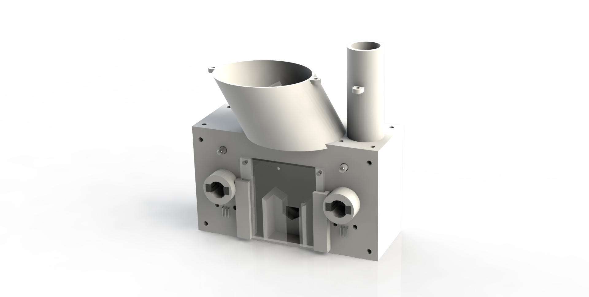

# Overview
As part of my involvement in the ULethbridge Hub for Neuroengineering Solutions, I developed a device to feed mice through a variety of triggers, enabling researchers to conduct experiments with vastly increased efficiency.

## Research Application
The multi-function feeder is designed to test decision-making in mice and their physical ability. These mice can be given different conditions such as Alzheimer's, and be tested against control mice.

The feeder is equipped with two LEDs, that turn on randomly. If the mice reach into the indicated hole, they get a food reward.

## Design Requirements
This design was required to have a few purposes:
- Allow a mouse to interact with LEDs and sensors, where a mouse has to respond to an LED and complete a task.
  - Once completed, the mouse should be fed
- Be able to feed a mouse normally, with no action necessary.
- Be able to feed a mouse with a reaching task, where they have to reach behind the acrylic for a food pellet to assess their physical ability and characterize diseases, including Parkinsons.
- Camera recordings, for the reaching interaction and general data collection.

### Purposes
This project has three purposes:
- Assess cognitive behaviour in mice, using two nose-poke holes and two indicator LEDs
- Feed the mice as a reward system, or generic feeding
- Assess mice reaching ability, through the acrylic sheet