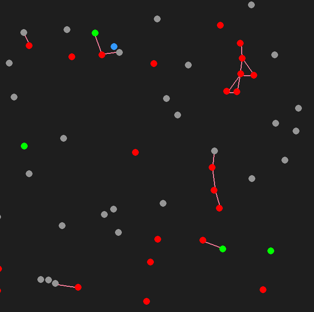
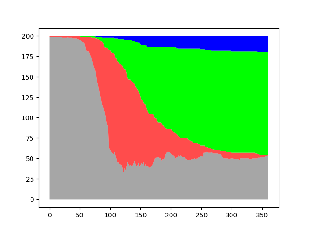

# Overview

In the midst of COVID-19, I was looking at how computers can simulate disease outbreaks such as the one we are experiencing right now. I made this as a proof of concept simulating immunity, death, and contact tracing. It was cool to learn and try new things with this. I made it in python using Pygame. I also learned about graphing in Matplotlib and saving CSV data, which was cool. You can check out the code linked above.

# Screenshots

