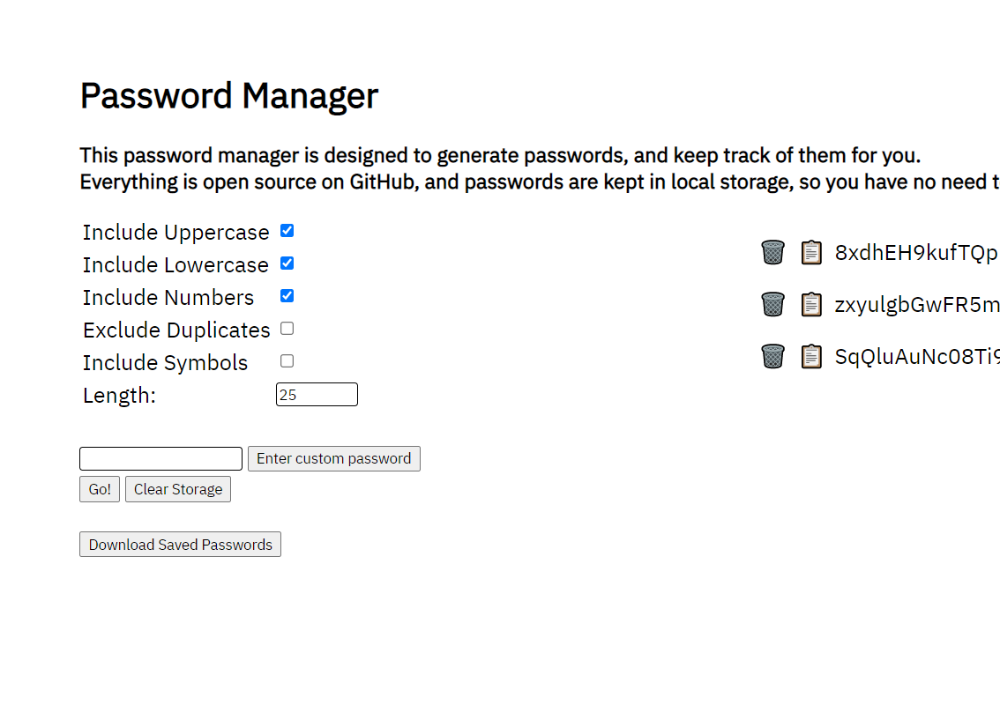

# Overview

This password manager is a very simple frontend app using localstorage to save data. It may not be the most secure in terms of being on a computer, but people find security in knowing that their data is not being transferred over the web, no matter how encrypted. It has some extra options that allow for generating and saving passwords as well, for some more convenience.

