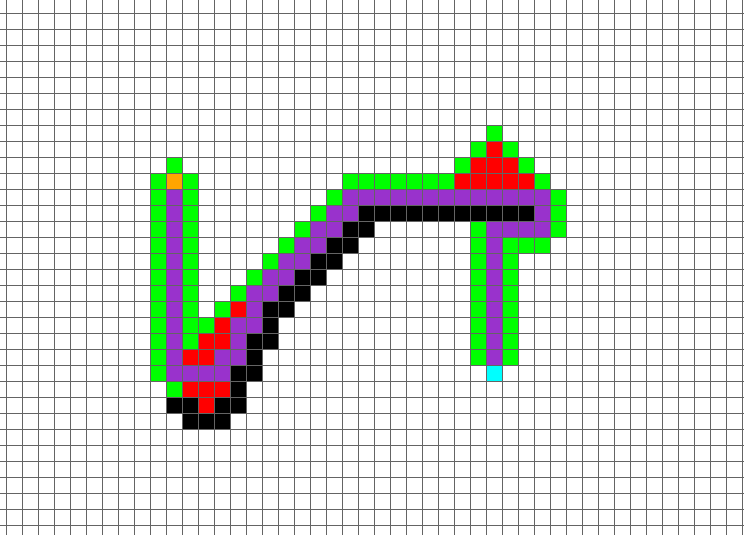
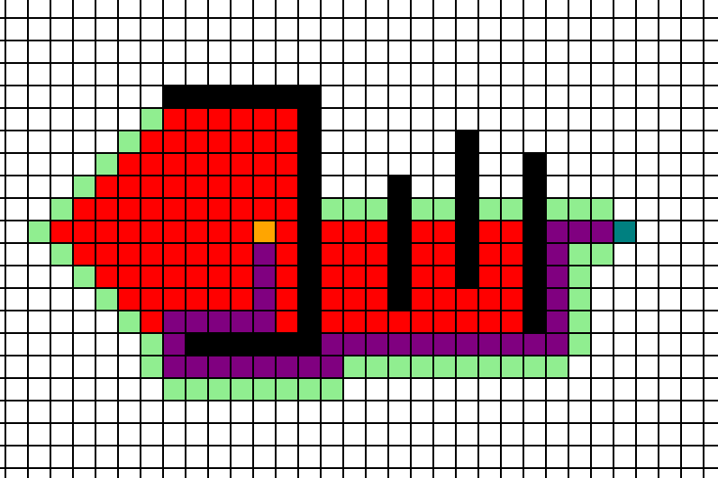
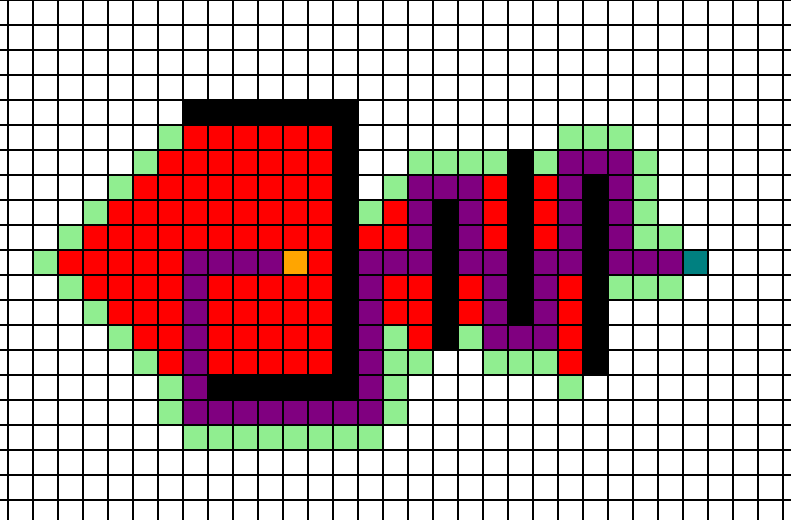
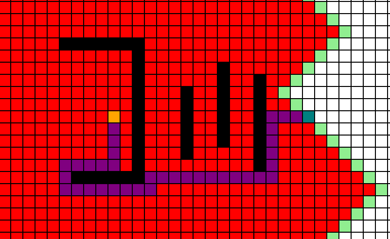
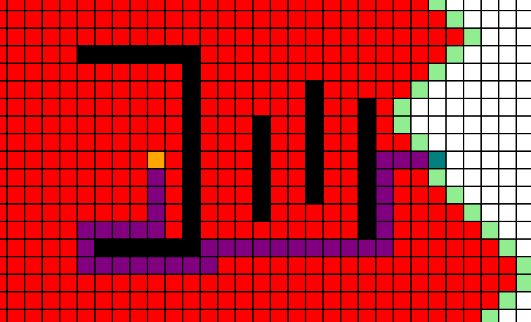
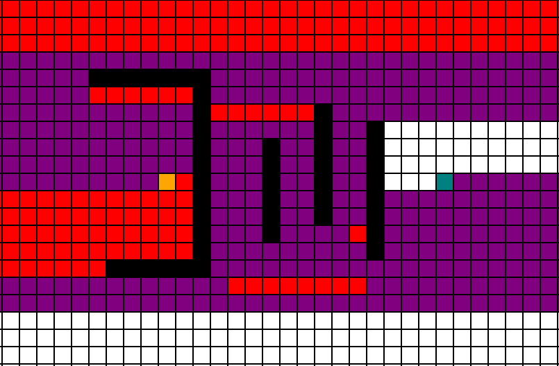
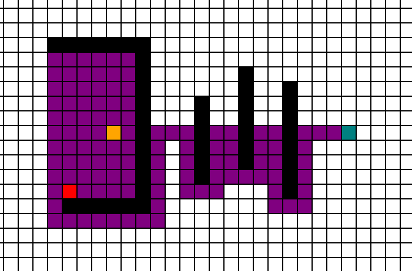

# Overview

I was looking at different types of pathfinding algorithms in python and javascript, and wanted to make a visualizer to show how they work. I started in Pygame, and made a pathfinding visualizer. It is pretty cool, and works well. It can use lots of different searching techniques. I had to do a lot of googling for A*, but I also implemented Dijkstra's Algorithm and Greedy Best First Search. After this, I decided that python was cool and all, but I wanted to make it in Javascript so I could put it on my website. So, after a few days of work, I have it up and running on the page linked above.

# Inspiration

Pathfinding algorithms always fascinated me, and they are also super useful. I'm working on learning about graphs and other advanced data structures, and this essentially implements that. It is also a must know for software development roles/jobs, so I wanted to get it under my belt.

# AStar (A*)

A* is notoriously the best pathfinding algorithm there is. This is because it is quick and uses heuristic values while maintaining the ability to always find the shortest path, unlike others (greedy best first search). First, we start by defining a heuristic measure, that must be equal to or more than the distance from the node to the end. Using this heuristic value and a priority queue, we can pull the most optimal nodes determining on both the heuristic and distance already travelled. Through continually pursuing optimally nodes in this way, we arrive at the end node in the most optimal way.

# Greedy Best First Search (GBFS)

Greedy Best First Search is usually a quicker alternative to A*, and can find paths to the end node in a faster fashion. However, the one major drawback is that it cannot guarantee the shortest path. It uses the distance from the end node to determine which node to pursue, disregarding the distance that has already been travelled.

# Dijkstras Algorithm

Dijkstras Algorithm is the first well known pathfinding algorithm, discovered/invented by Edsger Dijkstra. It, alike A*, can guarantee the shortest path between two nodes. This is however slower. It uses the cost to get to nodes as a value to determine which to pursue, pursuing the nodes closest to the starting node. It also can account for weights, being accounted into the 'weight' / 'distance' from the start.

# Breadth First Search (BFS)

BFS is used to search both graphs and trees, and starts with searching those closest to the starting node. It appears visually similar to Dijkstras, however is unweighted and cannot distinguish between weighted nodes and unweighted nodes.

# Depth First Search (DFS)

I like to think of DFS as the opposite of BFS, and is also used to search graphs and trees. It searches one branch as far as it possibly can go, and only backtracks when it has no more options.

# Snake

Last but not least ... snake! Through both this project and my [sorting visualizer](/projects/sorting-visualizer) project, I have done a lot of work but it has mostly been devised by other people. So, for both of these I create one of my own algorithms. Snake is a *slow* algorithm designed to be an improvement on Depth First Search. It can be thought of as an informed version of this, using a heuristic to determine the distance from the node and choose the optimal route. However, like a snake it will only look at new nodes and not the 'body' of the snake, leaving weaving patterns like found in DFS. Overall it is no better than A* or GBFS, but it was fun to make. And I should mention, it, like DFS, doesn't guarantee the shortest path.

