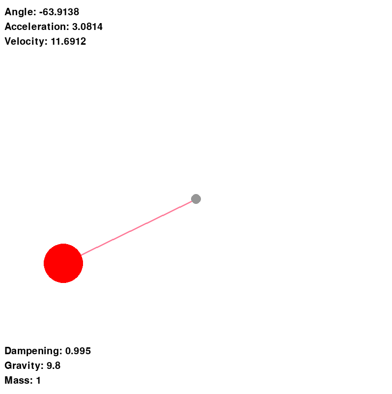
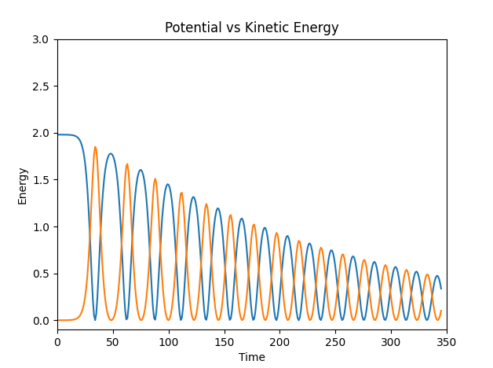

# Overview

I decided to create a physics simulation with a pendulum so I could represent potential and kinetic energy. It's a fun project made in pygame with python, using Matplotlib for some graphing. It is a quick and dirty project that I made while bored in CS class. All the code is on Github if you want to check it out.

Next steps for this might be operating in true human units, as I just used some arbitrary number (based off of pixels), so everything is relative to each other.

# Screenshots

