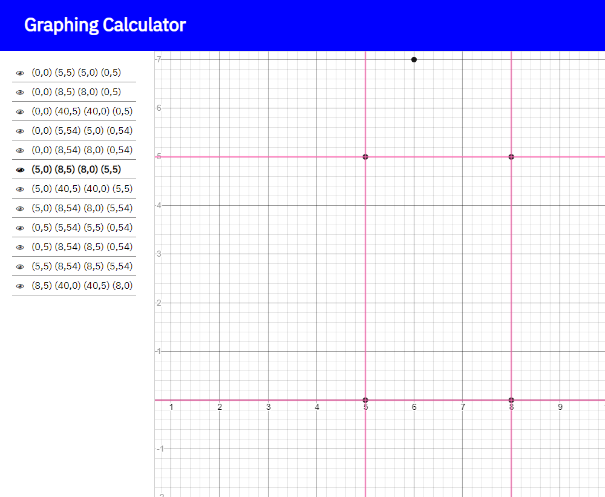

# Overview
I was intrigued by the question: "Given a list of points, how many rectangles can you make?". So I made a website that plots all of them! It currently doesn't allow user input, and probably never will, but it technically does take a list of points and returns the rectangles! I also used Desmos API for some plotting.

It's not perfect, there's a zooming bug and I'd love to allow user input, but I programmed it so long ago, I don't want to even try. I'd probably start over if I were to do this again, and I don't have enough interest to do so. But it still works in it's current form!