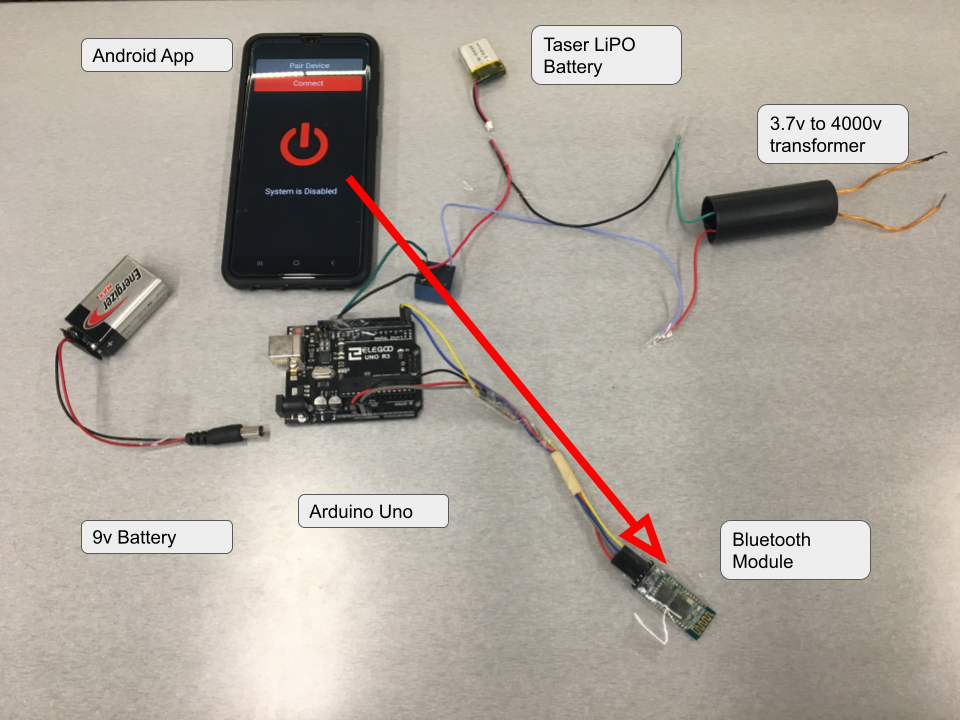

# Overview

For the Jamhacks 6 hackathon, me and my friend Janik decided to combat theft, specifically via a backpack device. After some brainstorming, we decided that the best way to do this was to fit a small taser, giving the thief a bit of a shock.

# Testing

I have made many projects, and usually the final product makes the work worthwhile. In this case, the process was the best. In other words.... we got to shock a lot of people. Check it out:

<video src='compilation.mp4'></video>

# Materials

* Arduino Uno
* 9V & 3.3V Battery
* Relay
* Transformer (3.3V -> 4000V)
* Android Phone
* Bluetooth Module

# Inspiration

Going into university next year, protecting belongings in open places is very important. Especially after Janik decided on going to Western University, and we both are planning on travelling over the summer, protecting belongings in a new environment should be a priority, so we decided to take action.

# What it does

Assembled in a backpack, the shockingly moral solution uses a small electrical setup to prevent theft. Utilizing a step-up transformer, we built a miniature (harmless) taser, that will stop thieves in their tracks.

# How we built it

This was built with simplicity in mind, with a small number of components working seamlessly together. It was designed to work effectively, and be lightweight and not take up a lot of space, as it would have to be carried around by the user anytime they wanted to use a backpack. Using an Android app built with MIT App Inventor, Bluetooth signals can be sent to a password protected Bluetooth module connected to an Arduino Uno. The app will signal to the electronic system when to enable the circuit, and can arm or disarm the security system.

When the system is armed, a current is passed through a relay which activates a separate circuit. This second circuit contains a 3.7 V LiPO battery, which powers a step-up transformer, converting the charge to 4000 V. The leads from this circuit are attached to the zippers of the backpack, and the circuit is completed when the thief touches both zippers. There are measures in place to ensure that the zippers do not come into contact with each other, shorting the circuit.

# What's Next

We want to continue working on this project, and the first obvious thing to do is to make the system integrate into the backpack zippers with more fluidity. There is currently tinfoil wrapped around the zippers, which makes it pretty obvious (and not very fashionable). We can fix this by having a bit more time, and being able to drill holes in the zippers, as well as being able to add insulation to the bottoms. This will make the backpack have the original look, and will be a much cleaner way of accomplishing the same product.

