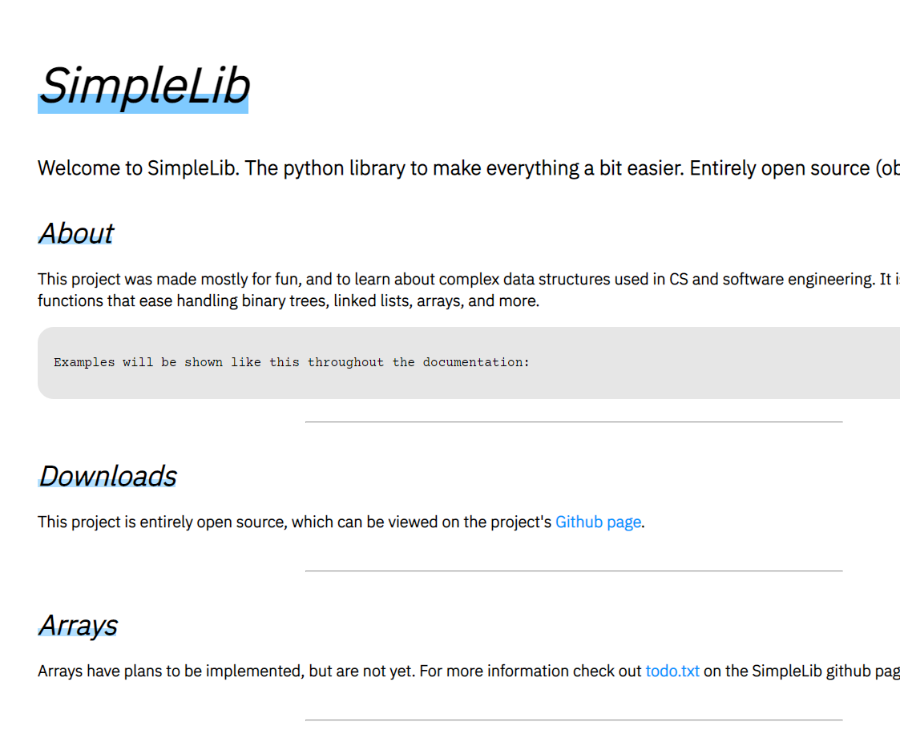

# Overview

Simplelib. The all in one python library. I designed this for ease of implementation of advanced data structures and algorithms in python. It implements custom hashmaps, binary search trees, advanced array support, linked lists, graphs, and much more. Check it out the documentation [here](https://owenmoogk.github.io/simplelib).

