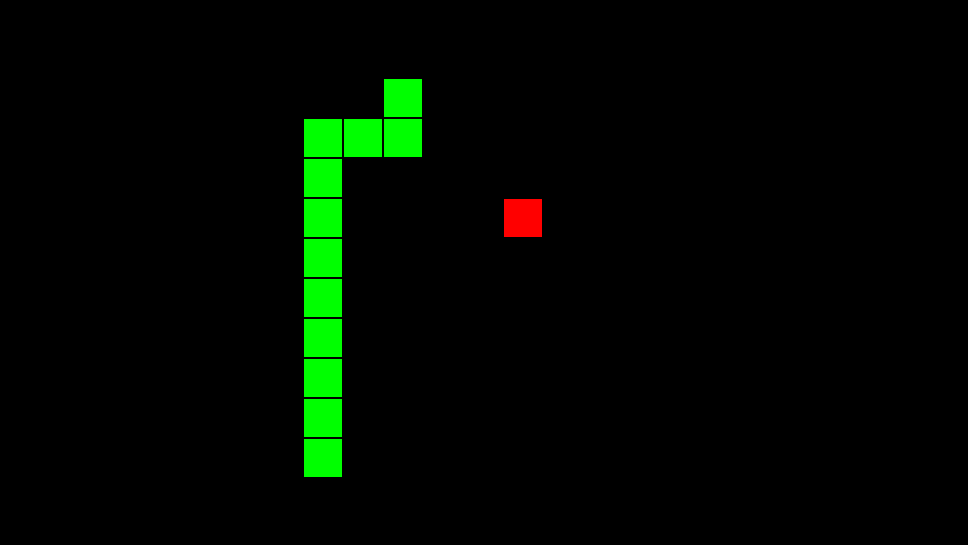

# Overview

I have been learning a bit about python, so I implemented the classic snake game into pygame. It started out as just a game that was playable with the arrow keys, but I have since evolved it into an AI program, teaching the computer to play the game. At the moment it is using the Hamiltonian cycle, which doesn't quite count, but I am working on another solution.

