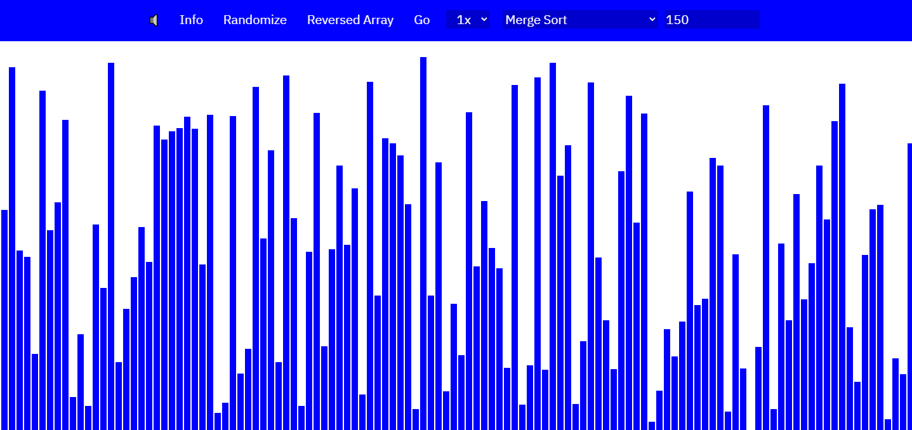

# Overview

I was interested in learning some more about sorting algorithms. And the best way to learn is to do. So I built this. It is a website coded entirely in Javascript, and implements many different sorting techniques from the basic bubble sort to other more efficient algorithms, such as merge sort and quick sort. It's linked above, to feel free to check it out!