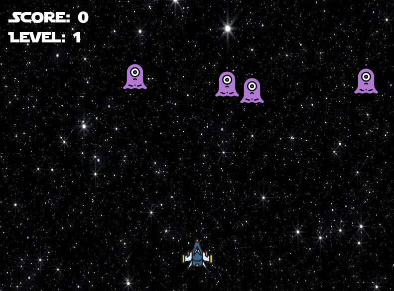

# Overview

I wanted to learn more about coding in python, as well as get out of just coding in the console. This is the first game I made with Pygame, and it's pretty cool. I plan to do more with this sort of thing in the future. As always, all files on my GitHub, and the links are at the bottom. PS. You can play this... just download and run the files on GitHub (make sure you have python dependencies installed).

# Screenshots

