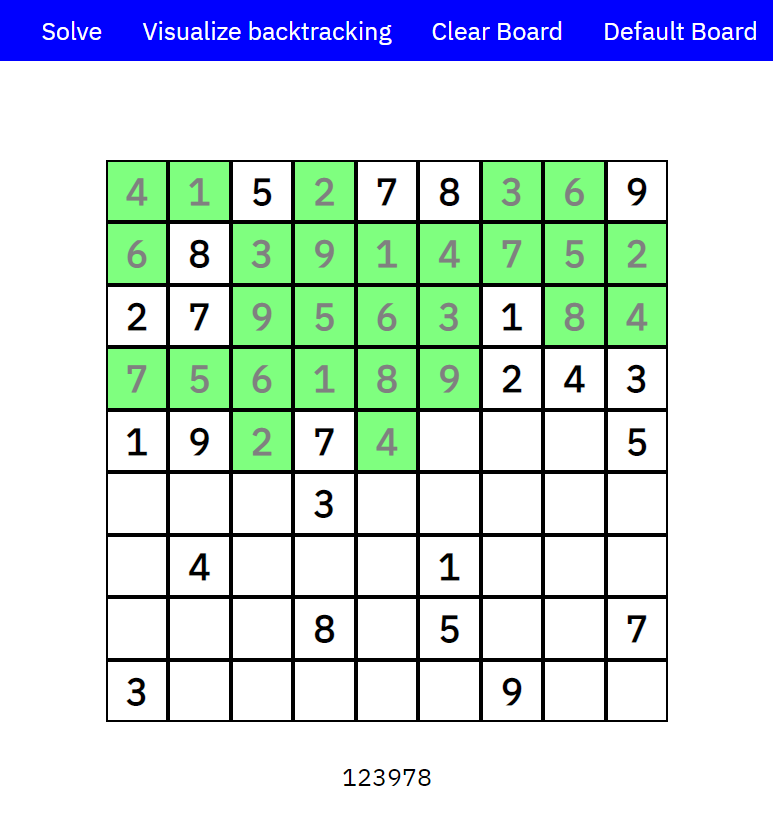

# Overview

The sudoku visualizer is a website... to visualize an algorithm solving sudoku. The concept is simple. I recently wrote a program in python using the backtracking algorithm to solve any sudoku. And it worked. Quite well actually. But I wanted to see the steps that the computer was going through to get this result. So I made this.

The best part about it is not only that it can solve a pre-prepared sudoku, but you can input your own and it will solve it. The Sunday paper has met its match!

# Technical

The backtracking algorithm is SUPER simple. Maybe not the most efficient thing out there, but sure works. It just puts numbers into the puzzle and then checks if it is valid. If so, it moves on and does the same. If not, then it goes to the next numbers (1-9). If all numbers do not fit then it goes back to the previous number (like a stack) and keeps counting up on that one. Eventually (very quickly as a computer) it solves it.

# Update

After leaving this for a while, I became interested in the applications of wave functions. Interestingly, a wave function collapse can be used to solve a sudoku. I am currently working on a visualization of this and will link it here when it is finished.

UPDATE: It's finished! Check it out [here](/projects/wave-function-collapse).