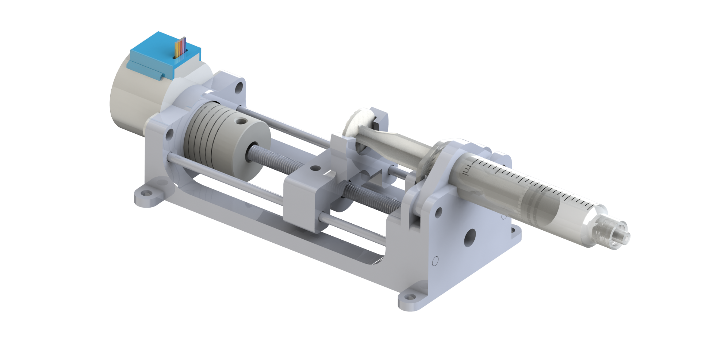

# Overview
As part of my involvement in the ULethbridge Hub for Neuroengineering Solutions, I developed a device to dispense water and medication to mice, enabling researchers to conduct experiments with increased efficiency and accuracy.

# Project Goals
The goals for this project were to 
- Be able to dispense a precise volume of liquid into a mouse habitat.
- Be able to reload with a new syringe rather quickly for rapid testing and usage.

# Implementation
Because the pump should be accurate and have high precision, a threaded rod is used as it greatly increases the mechanical advantage of the motor and thus, accuracy. It seems to be working well, and each step of the motor (the smallest actuation possible) is correlated with an incredibly small volume of liquid, meaning we have lots of precision over the amount of liquid dispensed.

## RFID
Since some of the mice had RFID tags embedded in their bodies, an RFID sensor was located directly below the spout. This way, the system can determine which mouse is drinking, so that different drugs can be dispensed for different mice, and the consumption of each mouse can be recorded.

## Lick Sensor
By adding a capacitive touch sensor on the water spout, we could determine if the mouse has it's mouth on the spout, therefore we only dispense the drug only when the mouse is there to drink it.