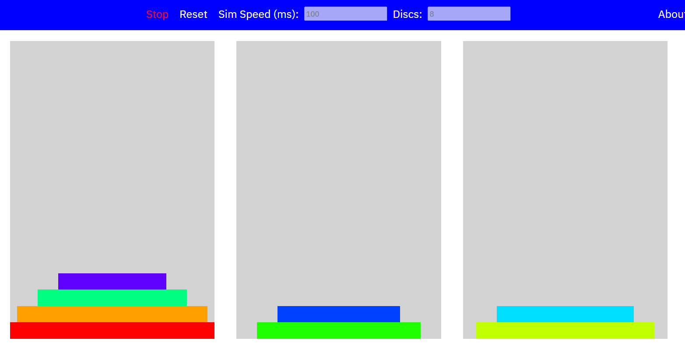

# Overview

I built a quick visualzation tool to help visualize the tower of hanoi solution. It's especially helpful to perform it with a large number of discs at a quick speed, as you can pick up on the pattern of the solution better. Check it out!
