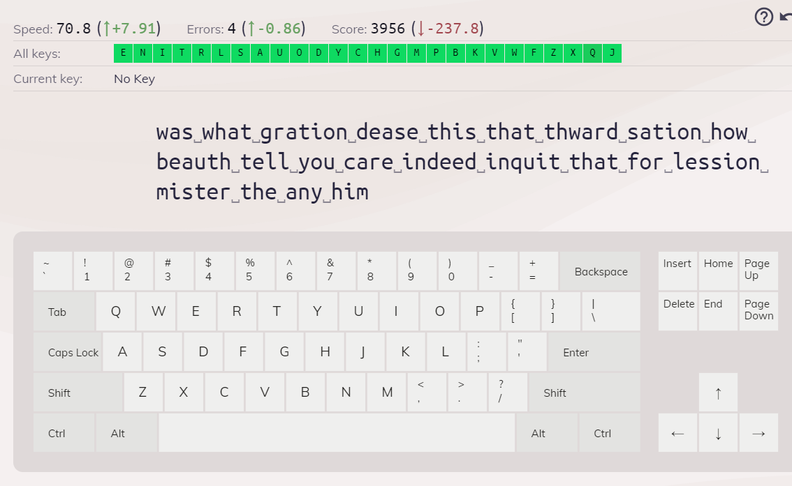

# Overview

This program is awesome. Typeracer is a game that many people know of, you race others to type the fastest. But, python is more powerful than any person typing. This app sees what is being displayed from the app and then will simulate the keystrokes.

# Technical

This is just a python script reading the screen. It uses PIL to take a screenshot of the screen, and then uses OpenCV to read the screenshot. Lastly, it uses PyTesseract to recognize the part of the screen displaying the text, and converts it to a string. From this, we parse the string accordingly and use the Pynput module to simulate keystrokes.

