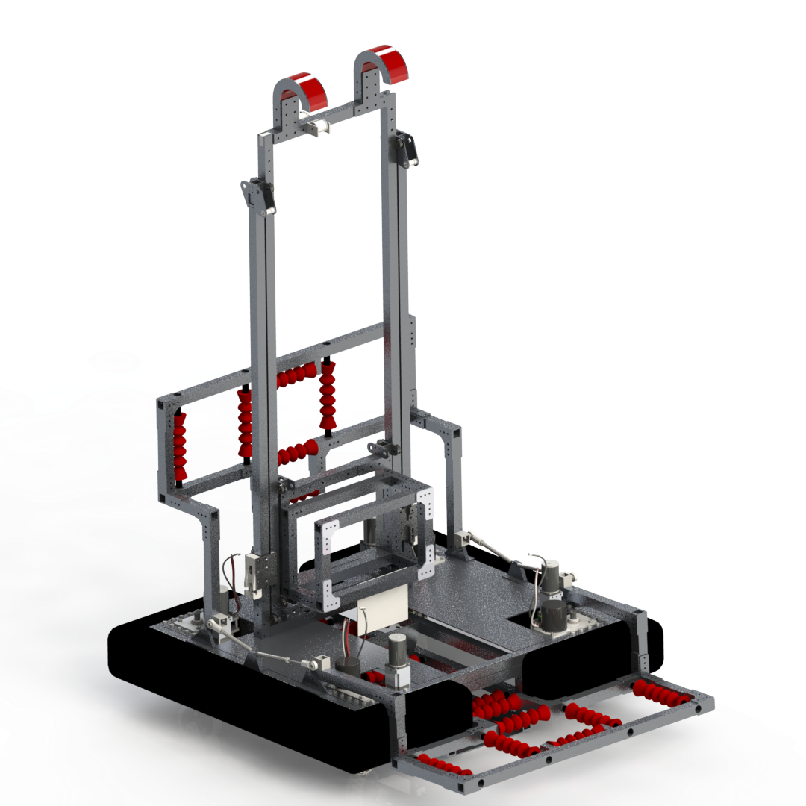
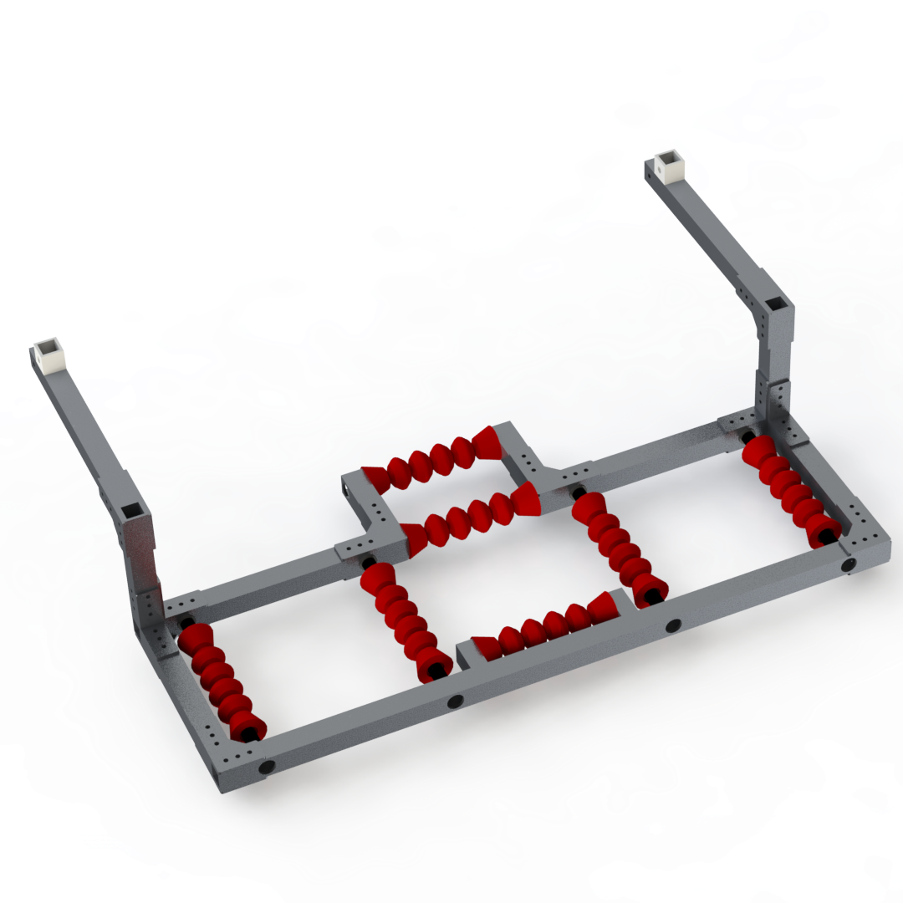
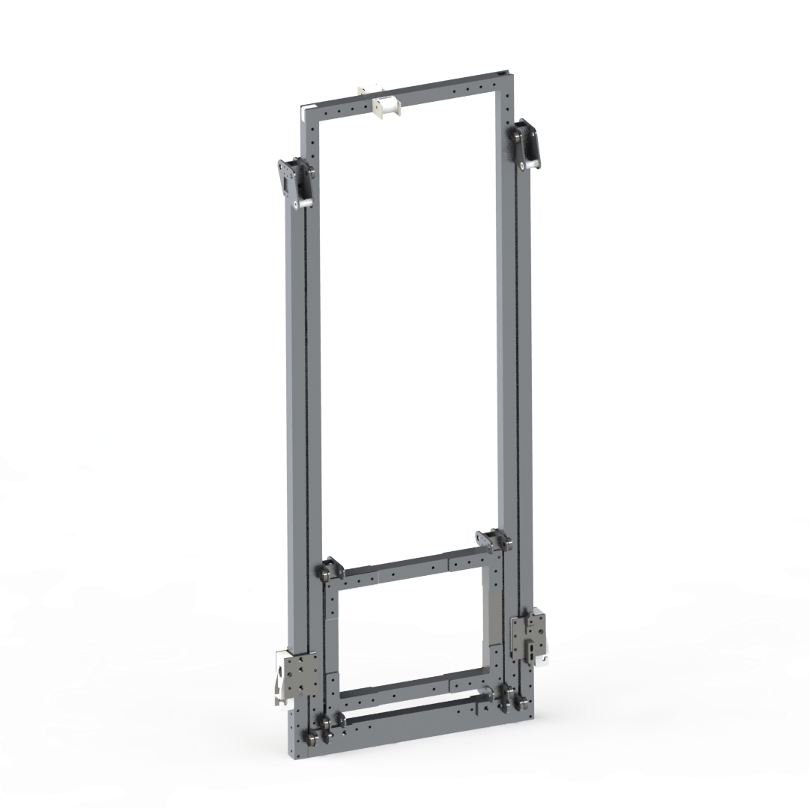

# Overview

I recently made a robot for a CAD challenge, and although it does not have all the motors mounted and the small details the main design is there and it was a fun project. We started this in april(...?) and I just finished some of it up and wanted to put it on the website.

# Intake

This intake is made up of rollers with polycord (which is probably not the greatest idea given my experience with the 2020 robot, but it was the best thing that came to mind with the game pieces). The rollers center it and pull it into the feeder system under the bot. They are all driven by 775 pro motors. Also I made sure to put an intake on both sides of the bot to give an advantage in maneuvering the field.

# Feeder

The feeder is on the underside of the bot, and it is also driven by rollers and polycord. It's sole purpose is to get the game pieces from both intakes and put them into one stream, and then to hand it off to the shooter mounted on the elevator.

# Shooter

The shooter is going to have some flywheels to shoot it out into the goal, but I have not yet put them into the CAD.

# Elevator

I used a very similar elevator design as we did with our 2019 robot on the rebels. It has a pulley to get essentially twice the height, and it has great speeds. It will be powered with two 775 pros.

# Climber

The top of the elevator has 2 bunny ears attached to it, so it can perform a climb at the end of the match. The elevator goes up and then hooks on, which can pull the robot up to the bar.

# Drivetrain

Lastly, I wanted to have some fun with the drivetrain, so I made it swerve. This was just a fun addition, but its pretty cool, and it will make it easier to move on the field.

