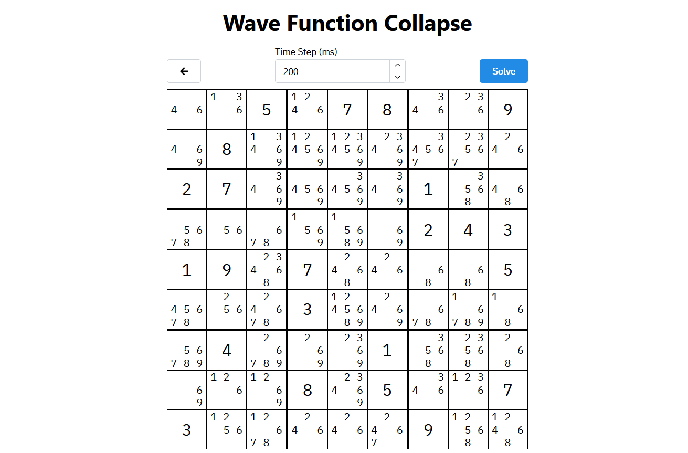

# Overview

A few years ago, I made a website to visualize the backtracking algorithm, using it to solve a sudoku. You can read more about that [here](/projects/sudoku-visualizer).

Ever since then, I've wanted to implement a more elegant solution, with a faster algorithm. And the one I was most interested in is a 'wave function collapse' algorithm. I stumbled upon [this video](https://www.youtube.com/watch?v=2SuvO4Gi7uY) about the algorithm, and it's wide range of applications through terrain generation and solving constraint problems. It's a unique method of solving a problem that can have between one and infinite solutions.

I originally didn't imagine it's applicibility to sudoku (given there is only a single solution), but it turns out it works all the same!

So much like my previous website that visualizes the backtracking algorithm, this does the same, with the wave function collapse algorithm!.

# Technical

Simply put, the sudoku originally has all of it's constraints and possibilites, and we look through the puzzle to find the cell with the least number of possiblities (hopefully one, but possibly more). Then, we choose one, and propagate that change to all the other cells ('collapse the wave function'). This continues until there is a conflict (ie. a cell has no possibilities anymore, meaning that we made a wrong decision somewhere along the way). From here, we backtrack and choose a different route, until we pick the right one.

[Check it out!](https://owenmoogk.github.io/wave-function-collapse)