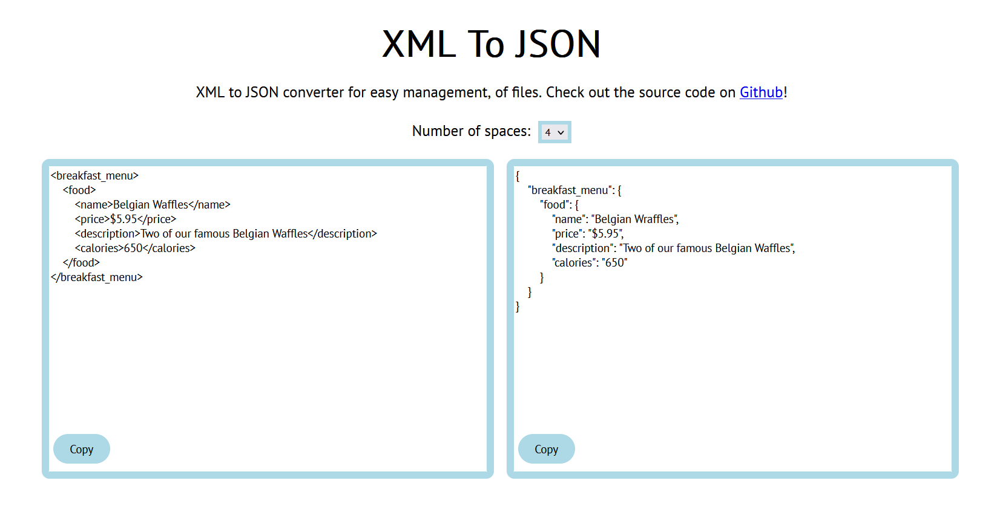

# Overview

I have been working on this website for the last... while. It has been a bit of a struggle as my coding skills a year ago when I made the first version were quite suboptimal, shall we say. They probably still are, but I definitely needed to improve from what it was.

I was using XML to store a lot of my data, and for the use case it was a terrible decision. I needed to convert them all to JSON, and it was way too tedious to do by hand. So I made some code to do it for me, and put it on a website for anyone to use in the future.

I also made a NPM package for this, which is available with `npm install @owenmoogk/xml-json-converter` or `yarn add @owenmoogk/xml-json-converter`.